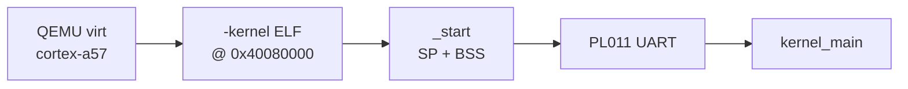
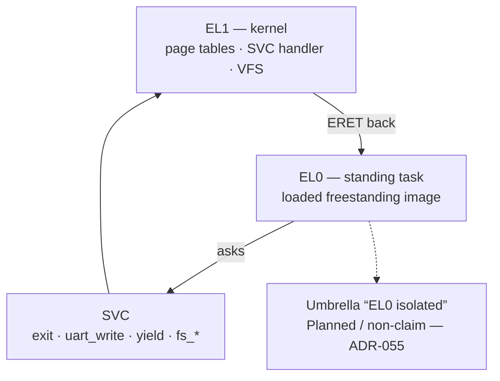
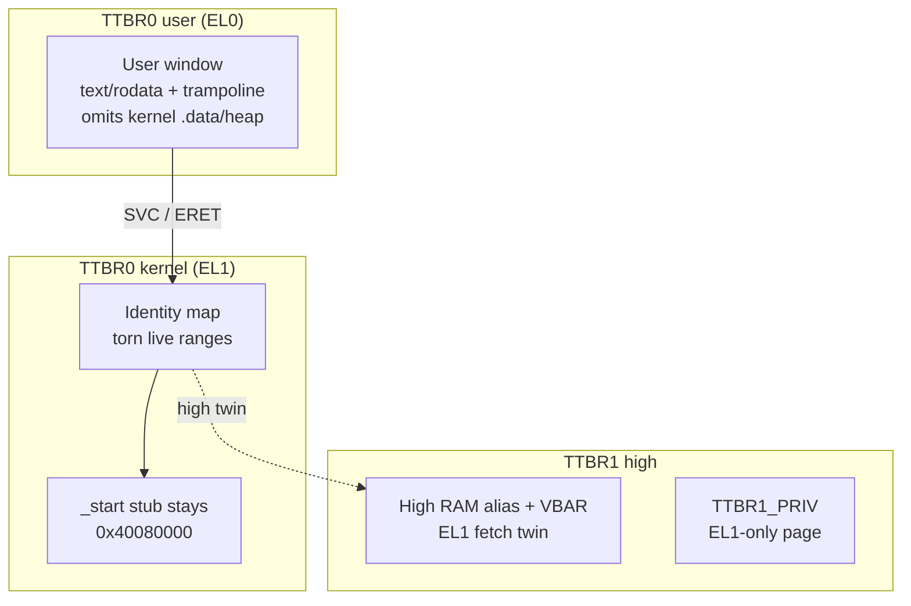
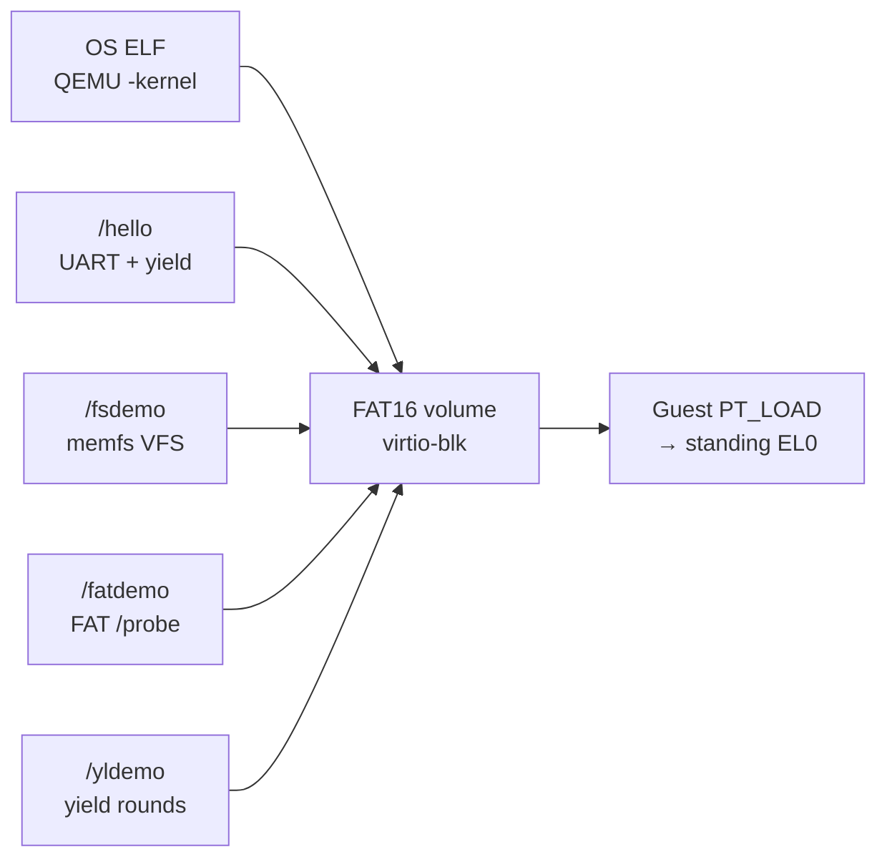
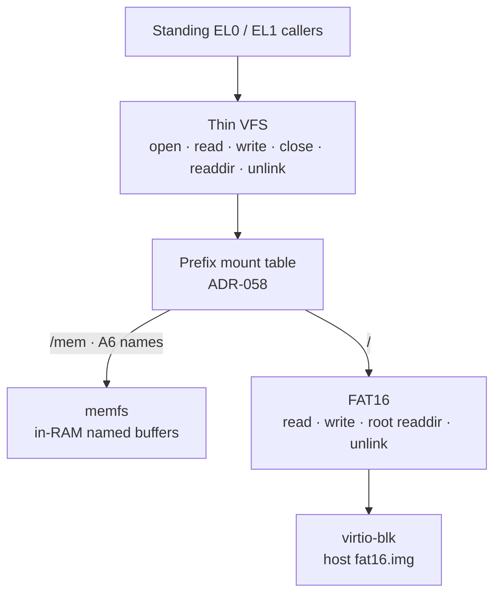
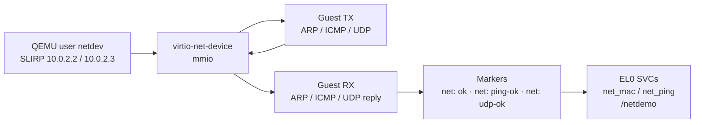

# Technical architecture

ctos is a `#![no_std]` `#![no_main]` binary. There is no Rust standard library and no OS underneath. The crate builds for a **custom target** (`aarch64-ctos.json`): `os: none`, panic abort, red zone off, static relocation, soft-float (no early SIMD/FP). See [ADR-003](../03-adr/ADR-003-primary-isa-aarch64.md). Guest samples (not “apps”): [apps-today.md](../framework/apps-today.md). Porting stance: [building-or-porting.md](../framework/building-or-porting.md).

## Boot path

1. `qemu-system-aarch64 -machine virt -cpu cortex-a57` (or `max`; `gic-version=3` is allowed).
2. `-kernel` loads the kernel ELF into virt RAM (linker base `0x40080000`).
3. Entry is `_start` (assembly in `src/main.rs`): set SP, zero BSS, call `kernel_main`.
4. Early output is the virt PL011 UART at `0x0900_0000` (`src/uart.rs`).
5. `kernel_main` installs `VBAR_EL1` (`src/exception.rs`, [ADR-004](../03-adr/ADR-004-el1-vbar-brk.md)) after UART init, then the EL1 identity map plus a TTBR1 private page and a cloned TTBR1 RAM alias ([ADR-008](../03-adr/ADR-008-identity-map-frame-allocator.md), W^X split [ADR-012](../03-adr/ADR-012-wx-nx-heap-stacks.md), stack guards [ADR-014](../03-adr/ADR-014-linker-stack-guard-pages.md), RO+NX [ADR-015](../03-adr/ADR-015-ro-nx-text-data.md), TTBR1 first cut [ADR-016](../03-adr/ADR-016-ttbr1-private-page.md), EL1 fetch mile [ADR-017](../03-adr/ADR-017-ttbr1-high-el1-exec.md), identity-tear first cut [ADR-018](../03-adr/ADR-018-identity-teardown-first-cut.md), identity `.text` range tear [ADR-019](../03-adr/ADR-019-identity-text-range-tear.md), live `.text` tear [ADR-020](../03-adr/ADR-020-identity-fnptr-reloc.md), identity `.rodata` tear [ADR-025](../03-adr/ADR-025-identity-rodata-tear.md)), then the frame pool **after** MMU + `SCTLR.C` (pre-MMU `.bss` stores can vanish), then the first-fit heap ([ADR-009](../03-adr/ADR-009-first-fit-heap.md)), then the cooperative scheduler ([ADR-010](../03-adr/ADR-010-cooperative-rr-el1.md)), then GICv2 + CNTP ([ADR-006](../03-adr/ADR-006-gicv2-generic-timer.md)). After `Hello World!` it proves map/unmap, `Box`/`Vec`, two tasks, heap NX, linker-stack guards, the EL0 first mile + standing context, ASID isolation, the TTBR1 private page and high-VA EL1 fetch, torn identity `.text` and `.rodata`, the PAN ID field, CNTPCT + IRQ-delta, several timer ticks, and polls PL011 RX ([ADR-007](../03-adr/ADR-007-pl011-uart-rx.md)).

*QEMU loads one OS ELF. Early print is UART; everything else starts in `kernel_main`. No bootloader crate, no VGA.*

There is no `bootloader` 0.9 crate and no VGA buffer. The x86_64 phil-opp path was deleted when this ADR landed.

`.cargo/config.toml` still needs `json-target-spec = true` on rustc 1.100 nightly. The AArch64 JSON is taken from `aarch64-unknown-none-softfloat` plus `os: none` / numeric widths. That nightly rejected the file until both `"abi": "softfloat"` and `"rustc-abi": "softfloat"` were set. Behavior is bare-metal AArch64, abort, `rust-lld`.

This architecture does **not** claim Raspberry Pi or other SoC support.

## Privilege: EL1 kernel vs standing EL0

The kernel runs at **EL1**. A freestanding image can stand at **EL0** and ask the kernel for help with **SVC** (`exit` / `uart_write` / `yield` / thin-VFS numbers). That is the ctos process model ([ADR-035](../03-adr/ADR-035-process-model-standing-el0.md)) — not Linux `fork` / `execve`. Many isolation **miles** are Verified; the umbrella sentence “EL0 isolated” stays **Planned / non-claim until checklist** ([ADR-055](../03-adr/ADR-055-el0-isolated-checklist.md); sponsor leftovers closure [ADR-060](../03-adr/ADR-060-isolation-leftovers-closure-checklist.md)). Details: [el0.md](../framework/el0.md).

*Standing EL0 + SVC is real. “EL0 isolated” is not claimed. Locked non-claims include PAN enable on default a57, taken SError on this smoke machine, and never-yank `_start`.*

## Memory sketch (identity / TTBR0 / TTBR1)

Simplified view of what the guest maps after bring-up. Live identity `.text` / `.rodata` / `.data` / heap / leftover RAM tears are Verified miles; the QEMU `-kernel` stub at `_start` **stays** mapped (`ident: start-stay`). High twins live under TTBR1. User TTBR0 is what standing EL0 walks.

*`_start` stays while live identity ranges are torn. User TTBR0 is not a full process mm. Do not say “the kernel moved.”*

## OS vs app slots

QEMU still `-kernel`s one **OS** ELF. Published freestanding EL0 samples live on the same FAT16 volume: **`/hello`** (A9 / UART+one yield), **`/fsdemo`** (ADR-059 / memfs via libctos), **`/fatdemo`** (ADR-061 / FAT `/probe` via libctos), **`/yldemo`** (ADR-062 / cooperative yield rounds). A2–A4 load `/hello` (no production embed). Cross-update is the same hello ELF on this OS and prior OS `ba6541c`. Product freestanding “app hosting done” is **Verified** under [ADR-048](../03-adr/ADR-048-app-hosting-claim-criteria.md) / [ADR-052](../03-adr/ADR-052-sponsor-accept-app-hosting.md) — not Linux/POSIX/containers/OTA. Recipes: [what-can-run.md](../overview/what-can-run.md). Companion: [hosting-apps.md](../overview/hosting-apps.md).

*One guest volume, three freestanding samples. Slots disconnect OS rebuilds from the published ELFs. Not a container runtime. Not POSIX.*

## Thin VFS stack

One thin VFS surface (`open` / `read` / `write` / `close` / `readdir` / `unlink`) with two backends and a **prefix mount table**: in-RAM **memfs** and **FAT16** on virtio-blk. `/mem` (+ A6 names) → memfs; `/` → FAT16. Read, write, root listing, delete, and mounts are depth miles — not POSIX. Stance: [filesystem.md](../overview/filesystem.md). [ADR-058](../03-adr/ADR-058-vfs-prefix-mounts.md).

*Same API, two backends, prefix mounts. Say “routed path prefixes through a mount table” when `vfs: mounts` passes — not `mount(2)` or “supports FAT” as a product.*

## Track N — virtio-net path (ARP + ICMP + UDP + EL0 net SVC)

QEMU **user** netdev (SLIRP) plus guest **virtio-net-mmio**. N1 exchanges one ARP request/reply with gateway `10.0.2.2` ([ADR-066](../03-adr/ADR-066-virtio-net-first-frame.md)). N2 sends an ICMP echo and expects a reply ([ADR-067](../03-adr/ADR-067-virtio-net-icmp-ping.md)). N3 sends one UDP datagram to SLIRP DNS `10.0.2.3:53` and expects a UDP reply ([ADR-070](../03-adr/ADR-070-n3-udp-transport.md)) — DNS is probe bait, not a DNS product. N4 exposes tiny EL0 SVCs (`net_mac` / `net_ping`) and FAT `/netdemo` ([ADR-068](../03-adr/ADR-068-el0-net-svc-sample.md)) — kernel still owns virtio-net. No BSD sockets / TCP product. Spec/ADR wins on conflict with this sketch.

*Host flags alone are not a probe. Do not say “has networking” or “has sockets.” Cite [ADR-063](../03-adr/ADR-063-network-foundation-scope.md) / [ADR-066](../03-adr/ADR-066-virtio-net-first-frame.md) / [ADR-067](../03-adr/ADR-067-virtio-net-icmp-ping.md) / [ADR-070](../03-adr/ADR-070-n3-udp-transport.md) / [ADR-068](../03-adr/ADR-068-el0-net-svc-sample.md).*

## Current stage (UART hello + M2–M9 + ADR-011 pillars)

- `Pl011` writer with TX-full wait and `\n` → `\r\n`; `try_recv` on `UARTFR.RXFE` / `UARTDR`
- `print!` / `println!` via `spin::Mutex`; fatal / unhandled / IRQ paths write the PL011 without the mutex
- After EL1 + VBAR, a bump frame allocator (`src/frame.rs`) and identity map (`src/paging.rs`) turn the MMU on ([ADR-008](../03-adr/ADR-008-identity-map-frame-allocator.md)); RAM after `__kernel_end` is PXN ([ADR-012](../03-adr/ADR-012-wx-nx-heap-stacks.md)); 4 KiB holes sit under the linker stacks ([ADR-014](../03-adr/ADR-014-linker-stack-guard-pages.md))
- First-fit `GlobalAlloc` (`src/heap.rs`) on a 64 KiB identity-mapped frame run ([ADR-009](../03-adr/ADR-009-first-fit-heap.md)); `build-std` includes `alloc`
- Cooperative round-robin (`src/sched.rs`): idle on the linker thread stack, two heap-backed workers, AAPCS64 callee-saved yield ([ADR-010](../03-adr/ADR-010-cooperative-rr-el1.md))
- `kernel_main` prints `Hello World!`, proves map/unmap (serial `paging: ok`), proves `Box`/`Vec` (serial `heap: ok`), proves two tasks (serial `sched: task a` / `sched: task b` / `sched: ok`), proves heap NX (serial `wx: ok`), proves linker-stack guards (serial `guard: ok`), proves the EL0 first mile + standing context (serial `el0: ok` / `el0: standing` / `el0: restored`), proves the SVC ABI (serial `svc: yield` / `svc: user-hi` / `svc: uart` / `svc: exit` / `svc: ok`), proves the `libctos` CRT (serial `libctos: hi` / `libctos: ok` / `libctos: linked`), proves the guest ELF PT_LOAD loader (serial `loader: mapped` / `loader: ok`), proves standing EL0 as a loaded task until `exit` (serial `el0: task-enter` / `el0: task-active` / `el0: task-exit` / `el0: task-restored` / `el0: restore-fail` / `el0: task-ok`), proves ASID isolation (serial `asid: ok`), proves the TTBR1 private page and high-VA EL1 fetch (serial `ttbr1: ok` / `ttbr1: el1 exec` / `ttbr1: vbar`), proves the identity-tear first cut, `.text` range tear, vtable rewrite, live `.text` tear, and identity `.rodata` tear (serial `ident: ok` / `ident: jump` / `ident: reloc` / `ident: range` / `ident: live` / `ident: rodata` / `ident: rodata-fault` / `ident: rodata-high` / `ident: text` / `ident: split` / `ident: fault` / `ident: high` / `ident: no el0`), proves the PAN ID field (serial `pan: id=` / `pan: absent`), proves CNTPCT advances (serial `perf: cntpct delta=…`), observes CNTP ticks (serial `timer: tick`) plus IRQ-to-handler deltas (serial `perf: irq-delta`), polls one host-injected RX byte (serial `input: rx 0x41`), fires one healthy-stack `BRK #0` (serial `exception: sync BRK`), then the FR-07 nest probe (serial `exception: fatal nested`)
- `VBAR_EL1` vector table (high alias after MMU, [ADR-017](../03-adr/ADR-017-ttbr1-high-el1-exec.md)); kernel runs on `SP_EL0`; first-level current-EL sync (SP_EL0 bank) handles AArch64 `BRK`, heap NX, guard-page data aborts, and the identity-tear IABORT; first-level IRQ handles GICv2 PPI 30; lower-EL AArch64 sync handles the EL0 SVC / UXN IABORT / standing dual-SVC / public SVC ABI / TTBR1 DABORT / torn-page DABORT; nested current-EL (SP_ELx bank) switches to the fatal stack ([ADR-004](../03-adr/ADR-004-el1-vbar-brk.md), [ADR-005](../03-adr/ADR-005-fatal-exception-stack.md), [ADR-006](../03-adr/ADR-006-gicv2-generic-timer.md), [ADR-007](../03-adr/ADR-007-pl011-uart-rx.md), [ADR-013](../03-adr/ADR-013-el0-isolation-direction.md), [ADR-016](../03-adr/ADR-016-ttbr1-private-page.md), [ADR-017](../03-adr/ADR-017-ttbr1-high-el1-exec.md), [ADR-018](../03-adr/ADR-018-identity-teardown-first-cut.md), [ADR-019](../03-adr/ADR-019-identity-text-range-tear.md), [ADR-020](../03-adr/ADR-020-identity-fnptr-reloc.md), [ADR-021](../03-adr/ADR-021-svc-syscall-abi.md))
- `cargo test` uses `#![feature(custom_test_frameworks)]` and `#[test_case]` (including VBAR, BRK, SPSel, stack ranges, guards, GIC TYPER, CNTFRQ, timer tick, IRQ-delta samples, empty UART RX FIFO, MMU on, frames, map/unmap, heap `Box`/`Vec`, two-task yield, CNTPCT loop, W^X flags + execute-from-heap, EL0 first mile + standing enter/leave, SVC ABI yield/uart/exit + kernel-`.data` / TTBR1-alias reject, libctos hello trip, guest ELF loader trip, standing-task until exit + fail-closed fault restore, ASID isolation, TTBR1 private page + high-VA EL1 fetch, identity-tear first cut + `.text` range tear + vtable rewrite + live `.text` tear; `is_active()` is false at rest)
- QEMU exit is ARM **semihosting** `SYS_EXIT` / `hlt #0xf000` (`src/qemu.rs`), not `isa-debug-exit`. Needs `-semihosting` on the QEMU line (`scripts/qemu-aarch64.sh`).
- Host smoke: `scripts/qemu-smoke.sh` (hello + paging + heap + two-task sched + W^X + guards + EL0 first mile + standing + SVC ABI + libctos CRT + guest ELF loader + standing-task (A4) + ASID isolation + TTBR1 private page + high-VA EL1 fetch + identity-tear first cut + identity `.text` range tear + vtable rewrite + live `.text` tear + CNTPCT baseline + IRQ-delta + host ELF size + timer tick + injected UART RX + BRK + fatal nested strings + tests + `force-fail` must be non-zero)
- Docker: `Dockerfile` / `scripts/docker-smoke.sh` (linux/arm64-friendly; do not pin amd64)
- GHA: `.github/workflows/smoke.yml` (`ubuntu-24.04-arm` and `ubuntu-24.04`)

Source + local smoke were first probed on 2026-09-08 (see the honesty ledger). Current idle tip is `main` ≈ `190ef5a` (Merge PR #106 / docs polish after ADR-061). Recent docs/miles: ADR-058–061 plus ADR-062 `yield-libctos` (this PR when merged). Earlier Docker Verified on tip `e80dc93` (Merge PR #28 / ADR-020; 50 tests, `ident: reloc n=12`, live pages=37, force-fail ok) and prior SHAs `24d94e6` (ADR-019), `b0f0ee5` (#24–#26), `71ee15f` (layout L3). Keep the `b2bbb99` Failed row. GHA merge-commit [34651404108](https://github.com/artofdream/ctos/actions/runs/34651404108) on `e80dc93` grepped that ADR-020 class of markers. A Route 53 CNAME `ctos.artof.link` → `artofdream.github.io.` exists; **https://ctos.artof.link HTTPS is Verified** (2026-09-11 after #30). Do not claim “secure OS,” “the kernel moved,” or “EL0 isolated.” Tip smoke / Docker / GHA on `97a8559` itself: see the [honesty ledger](../framework/honesty-ledger.md) (do not invent Verified from this docs edit).

## Planned stages

| Stage | Domain work |
| --- | --- |
| Custom test framework | Landed (M2): `#[test_case]`, semihosting exit, UART |
| CPU exceptions | M3: `VBAR_EL1`, resumable `BRK`. M4: dedicated exception + fatal stacks (FR-07) — cloud `qemu-smoke` Verified (honesty ledger); GHA Unknown until a run URL |
| Hardware interrupts | M5: GICv2 + CNTP tick (FR-08) — cloud `qemu-smoke` + GHA Verified (honesty ledger). M6: PL011 UART RX (FR-08 input / ADR-007) |
| Paging | M7: EL1 identity map + bump frames (FR-09 / ADR-008) — probe status in the honesty ledger. DTB walk staged. |
| Heap | M8: first-fit `GlobalAlloc` on identity-mapped frames (FR-10 / ADR-009) — probe status in the honesty ledger. |
| Scheduler | M9: cooperative EL1 yield (FR-11 / ADR-010) — probe status in the honesty ledger. Not preemptive. |
| Pillars | [ADR-011](../03-adr/ADR-011-three-pillars.md): antifragility / security / performance. Threat-model **v1.37** ([security.md](../framework/security.md)). Heap NX ([ADR-012](../03-adr/ADR-012-wx-nx-heap-stacks.md)). Linker-stack guards ([ADR-014](../03-adr/ADR-014-linker-stack-guard-pages.md)). EL0 first mile + standing + ASID TLB mile; TTBR1 first cut ([ADR-016](../03-adr/ADR-016-ttbr1-private-page.md)); EL1 high-VA fetch ([ADR-017](../03-adr/ADR-017-ttbr1-high-el1-exec.md)); identity-tear first cut ([ADR-018](../03-adr/ADR-018-identity-teardown-first-cut.md)); identity `.text` range tear ([ADR-019](../03-adr/ADR-019-identity-text-range-tear.md)); live `.text` tear ([ADR-020](../03-adr/ADR-020-identity-fnptr-reloc.md)); SVC ABI ([ADR-021](../03-adr/ADR-021-svc-syscall-abi.md)); `libctos` CRT ([ADR-022](../03-adr/ADR-022-libctos-crt.md)); guest ELF PT_LOAD loader ([ADR-023](../03-adr/ADR-023-elf-pt-load-loader.md)); standing EL0 as normal mode ([ADR-024](../03-adr/ADR-024-standing-el0-normal.md)); identity `.rodata` tear ([ADR-025](../03-adr/ADR-025-identity-rodata-tear.md)); PAN capability ([ADR-026](../03-adr/ADR-026-pan-capability.md), enable locked non-goal on default a57 per [ADR-054](../03-adr/ADR-054-pan-enable-lock.md)); thin VFS + memfs ([ADR-027](../03-adr/ADR-027-thin-vfs-memfs.md)); virtio-blk + FAT16 ([ADR-028](../03-adr/ADR-028-virtio-blk-fat16.md)); FAT16 write ([ADR-050](../03-adr/ADR-050-fat16-write.md)); FAT16 readdir ([ADR-056](../03-adr/ADR-056-fat16-readdir.md)); OS/app slot first cut ([ADR-030](../03-adr/ADR-030-os-app-slots.md)); leftover cross-update + FAT-only hello ([ADR-032](../03-adr/ADR-032-track-a-leftovers.md)); freestanding sample catalog `/hello` + `/fsdemo` + `/fatdemo` + `/yldemo` ([ADR-059](../03-adr/ADR-059-fs-libctos-sample.md) / [ADR-061](../03-adr/ADR-061-fat-libctos-sample.md) / [ADR-062](../03-adr/ADR-062-yield-libctos-sample.md)); umbrella isolation Planned/non-claim until checklist ([ADR-013](../03-adr/ADR-013-el0-isolation-direction.md) / [ADR-047](../03-adr/ADR-047-isolation-leftovers-decisions.md) / [ADR-055](../03-adr/ADR-055-el0-isolated-checklist.md); sponsor leftovers closure [ADR-060](../03-adr/ADR-060-isolation-leftovers-closure-checklist.md)). Product freestanding app hosting **Verified** under [ADR-048](../03-adr/ADR-048-app-hosting-claim-criteria.md) / [ADR-052](../03-adr/ADR-052-sponsor-accept-app-hosting.md) (Track A #31; not Linux/POSIX/containers). |
| Filesystem | Thin VFS + memfs ([ADR-027](../03-adr/ADR-027-thin-vfs-memfs.md)) + virtio-blk / FAT16 read ([ADR-028](../03-adr/ADR-028-virtio-blk-fat16.md)) + write ([ADR-050](../03-adr/ADR-050-fat16-write.md)) + root readdir ([ADR-056](../03-adr/ADR-056-fat16-readdir.md)) + root delete ([ADR-057](../03-adr/ADR-057-fat16-delete.md)) + prefix mounts ([ADR-058](../03-adr/ADR-058-vfs-prefix-mounts.md)). FAT also carries freestanding samples `/hello` / `/fsdemo` / `/fatdemo` / `/yldemo` (catalog, not a second FS). Stance: [filesystem.md](../framework/filesystem.md). |
| Host apps / containers | Gaps to Linux/shell/Python: [host-apps.md](../framework/host-apps.md). Linux-compat is a research frame ([ADR-031](../03-adr/ADR-031-linux-compat-goals.md)); **not claiming Linux userspace yet**. Guest container runtime is a **non-goal** ([ADR-029](../03-adr/ADR-029-containers-nongoal.md)). Host `docker-smoke` is unrelated. A1 is a kernel SVC ABI mile. A2 is a `libctos` CRT mile. A3 is a guest ELF PT_LOAD loader mile. A4 is standing EL0 as normal mode for a loaded image. A6 is thin VFS + memfs. A7 is virtio-blk + FAT16. A8/A9 recipes + slot; freestanding catalog `/hello` + `/fsdemo` + `/fatdemo` + `/yldemo` ([ADR-059](../03-adr/ADR-059-fs-libctos-sample.md) / [ADR-061](../03-adr/ADR-061-fat-libctos-sample.md) / [ADR-062](../03-adr/ADR-062-yield-libctos-sample.md)). |
| Immutability | Scoped RO only ([immutability.md](../framework/immutability.md)). Absolute “immutable OS” is incompatible. Track A [#31](https://github.com/artofdream/ctos/issues/31) / Track B [#40](https://github.com/artofdream/ctos/issues/40). |

Each stage is one loop unit on the [roadmap](../04-roadmap/roadmap.md).

x86_64 remains a possible **future secondary** ISA. It is not a current tree.

## Harness mapping (short)

Hardware and QEMU are the **domain**. Docs, ADRs, and this architecture note are **shared understanding**. Guides, sensors, the one-PR loop, second-brain vaults, merge permissions, and the honesty ledger are the **outer harness**. Details: [formula.md](../framework/formula.md).
