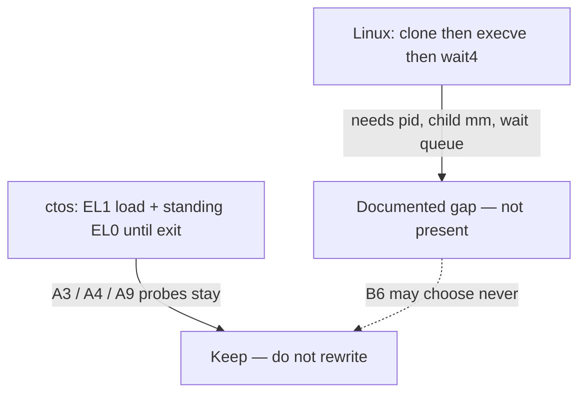

# ADR-035 — Process model: Linux fork/exec/wait vs ctos standing EL0

- Status: Accepted (docs frame; no Linux process-model claim)
- Date: 2026-09-12

## Context

Track B ([issue #40](https://github.com/artofdream/ctos/issues/40)) is Linux-compat **research**. Child [B3 / #43](https://github.com/artofdream/ctos/issues/43) asks to compare the Linux process model (`fork` / `exec` / `wait`) to ctos standing EL0 and the EL1 cooperative scheduler, and to **decide an approach without abandoning probes**.

[ADR-031](ADR-031-linux-compat-goals.md) already frames Linux-compat as ABI-**subset** research. It is **not claiming Linux userspace.** Guest OCI / Docker / Kubernetes stays a **non-goal** ([ADR-029](ADR-029-containers-nongoal.md)). This ADR cites those decisions. It does **not** reopen containers, mint a process table, or add syscalls.

[B2](../research/linux-aarch64-syscall-gap.md) mapped numbers only. Process and lifetime rows there are **absent** or **partial**:

| Linux AArch64 (v6.10) | ctos today |
| --- | --- |
| No `fork` syscall — userspace `fork()` is `clone` (220) / `clone3` (435) | **absent** |
| `execve` (221) / `execveat` (281) | **absent** — A3 maps freestanding `PT_LOAD` and **rejects `PT_INTERP`**. A9 FAT `/hello` is an EL1 load path. |
| `wait4` (260) / `waitid` (95) | **absent** — no child to wait for |
| `exit` (93) / `exit_group` (94) | **partial** — `SYS_EXIT` **16** ends the standing EL0 trip |
| `getpid` / `gettid` / `set_tid_address` / `kill` | **absent** — no pid, tid, or signals |
| `clone` + `CLONE_NEW*` | **never-per-ADR-031** (namespaces; see ADR-029) |

Track A first cuts that this mile must **not** rewrite:

- Standing EL0 as normal mode for one loaded image ([ADR-024](ADR-024-standing-el0-normal.md)).
- Freestanding ELF64 `PT_LOAD` loader ([ADR-023](ADR-023-elf-pt-load-loader.md)).
- EL1 cooperative yield of two heap-backed workers ([ADR-010](ADR-010-cooperative-rr-el1.md)).
- Tiny SVC ABI (`exit` / `uart_write` / `yield`, then memfs 19–23) ([ADR-021](ADR-021-svc-syscall-abi.md)).

This ADR does **not** implement B4–B6. It does **not** add `fork` / `clone` / `execve` / `wait*` to `src/`. It does **not** mint FR-16+ or NFR-15+. File presence of this page is not a Linux process table.

## Hypotheses

| ID | Option | Notes |
| --- | --- | --- |
| **H1 (chosen)** | Keep **standing EL0** (one loaded trip) plus EL1 cooperative yield as the ctos process model. Document Linux `fork` / `exec` / `wait` as a **gap**. Do not add those syscalls. Do not rewrite A1–A9 probes. Any Linux-shaped process table is a later epic **after** B6 names a path, or **never**. | Matches #43 (“decide approach without abandoning probes”) and ADR-031. Leaves B4–B6 room. |
| **H2 (rejected)** | Promise Linux `fork` / `execve` / `wait`, a pid table, or “runs a shell.” | Honesty fail (NFR-06). No probe exists. |
| **H3 (rejected)** | Treat A4 standing EL0 or A9 FAT `/hello` as `execve`. | The loader is EL1-driven. It rejects `PT_INTERP`. `SYS_EXIT` returns to the EL1 caller, not a parent pid. |
| **H4 (rejected)** | Treat M9 EL1 coop workers as Linux threads / `clone(CLONE_THREAD)`. | Those tasks are kernel EL1. `SYS_YIELD` does **not** call `sched::yield_now`. |
| **H5 (rejected)** | Add `clone` / `wait4` as Planned implementation on this track, or reopen `CLONE_NEW*`. | Would turn a research compare into a backlog. Namespace flags stay **never-per-ADR-031**. B6 may still choose **never**. |

## Decision

1. **ctos process model stays standing EL0.** One freestanding image is loaded by EL1 (A3 / A9), installed as a standing **task** (`install_task`), and `ERET`ed. It runs at EL0 until `SYS_EXIT` or an unexpected lower-EL sync. Restore is fail-closed (`el0: task-restored` / `el0: restore-fail`). `is_active()` / `is_task()` are true only for that lifetime. There is **no** process table, pid, ppid, tid, or parent/child wait queue.

2. **EL1 cooperative yield stays a different machine.** [ADR-010](ADR-010-cooperative-rr-el1.md) switches two heap-backed **EL1** workers. It is not preemptive, not SMP, and not EL0. `SYS_YIELD` **18** is a dispatch-only hint that returns to EL0. Do not describe those workers as Linux threads.

3. **Linux `fork` / `exec` / `wait` is a documented gap, not a present analog.**

   | Linux idea | What it needs | What ctos has |
   | --- | --- | --- |
   | `fork` / `clone` | Child pid, optional new `mm`, COW or share, parent continues | One standing context. Shared user TTBR0 window. No child. |
   | `execve` | Replace the **current** image; keep pid / fds / cwd; load interpreter via `PT_INTERP` / auxv | EL1 maps a freestanding `ET_EXEC` and `ERET`s. Rejects `PT_INTERP`. No fd table to keep. B4 is the ELF/auxv compare. |
   | `wait` / `waitid` | Parent blocks or polls; reaps a child status | `SYS_EXIT` returns to the **EL1 hello path** that launched the trip. No waiter. |
   | `exit` vs `exit_group` | Thread vs process-group teardown | One trip ends. No thread group. musl/glibc CRT usually hits `exit_group`. |
   | Signals / `kill` | Delivery + `waitid` | Lower-EL IRQ still parks. No POSIX signals. |

   On Linux AArch64, say **`clone` + `execve` + `wait4`**, not a `fork` syscall. Userspace `fork()` is a libc wrapper.

4. **Goals (research stance only).**

   | Goal | Why |
   | --- | --- |
   | Name the two models so later children cannot blur them | Honesty (NFR-06). File presence is not `execve`. |
   | Keep A1–A9 serial markers and fail-closed smoke | Antifragility (NFR-05). This mile must not retarget SVC 16–23 or drop `el0: task-ok`. |
   | Leave B6 free to choose compat layer vs reimplement vs **never** | ADR-031. A process table is not pre-chosen. |
   | Keep `CLONE_NEW*` / mount / guest OCI out | ADR-029 / ADR-031 **never**. |

5. **Non-goals.** Same family as ADR-031:

   - Implementing `clone` / `clone3` / `execve` / `execveat` / `wait4` / `waitid` / `getpid` / `kill` in `src/`.
   - A pid / tid / process-group table.
   - COW address spaces, `CLONE_VM` / `CLONE_THREAD` / `CLONE_FILES`.
   - Treating A3 / A4 / A9 as Linux `exec`.
   - Treating `SYS_EXIT` as `exit_group`.
   - Full Linux ABI / POSIX product / glibc or musl ports / “runs a shell.”
   - Guest OCI / Docker / Kubernetes ([ADR-029](ADR-029-containers-nongoal.md)).
   - Replacing the freestanding Track A path.
   - B4 (ELF / auxv / `PT_INTERP`) and B5 (Linux VFS concepts) — those stay their own children.
   - New FR/NFR IDs. Frozen set stays [fr-nfr.md](../02-requirements/fr-nfr.md).
   - Author self-merge ([ADR-002](ADR-002-pr-identity-split.md)).

6. **Approach if B6 later names a path (not a decision).** A hint only:

   1. **In-tree `libctos` apps need no Linux process model.** Sequential standing trips (EL1 loads the next FAT image after `exit`) would still be ctos-native, not `fork`/`wait`.
   2. **A static musl `_start` is not a small subset.** Typical CRT wants `set_tid_address`, `exit_group`, and often a pid. `clone`/`execve`/`wait4` are larger than convention translation + `write` on a console fd (B2’s smallest *named* slice).
   3. **If** B6 chooses a compat path, a later epic would still need: a process table, a child `mm` (copy or COW), a wait queue, and an EL0-driven replace-image path. That epic needs its own probes. It must not silently retarget today’s `SYS_EXIT` or drop standing-task markers.
   4. **Never remains valid.** Standing EL0 can stay the model indefinitely.

7. **Keep (ctos specificity).** Same invariants as ADR-031: honesty, antifragility, security, performance, document-first / one-PR loops, freestanding Track A path, QEMU `virt` / AArch64 ([ADR-003](ADR-003-primary-isa-aarch64.md)), ADR-gated EL0 / identity teardown. Do not claim “EL0 isolated,” “secure OS,” or a bench for a process table that does not exist.

8. **Not claiming Linux userspace yet.** Say that sentence on the Track B page. The ledger row “Guest runs host apps (Linux ELF / shell / Python)” stays **Planned**. This ADR does **not** change that row to Verified.

## Consequences

- Docs: this ADR. [track-b.md](../04-roadmap/track-b.md) B3 becomes **Documented**. [SUMMARY.md](../SUMMARY.md) and [roadmap.md](../04-roadmap/roadmap.md) link here. [linux-aarch64-syscall-gap.md](../research/linux-aarch64-syscall-gap.md) points process rows at this file.
- B4 is **Documented** on `main` ([ADR-033](ADR-033-linux-elf-auxv-pt-interp.md)). B5 / B6 stay **Planned** research. No `src/` change in this PR.
- Track A remains the product path for in-tree freestanding apps. Standing EL0 is not a Linux process. “App hosting is done” stays unclaimed.
- Honesty: document inspection only. Do not add a Verified Linux-process or `execve` ledger row because this file exists.
