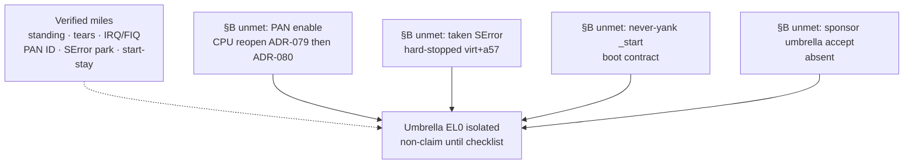

# ADR-060 — Isolation leftovers closure checklist for sponsor

- Status: Accepted (docs). Updated 2026-09-19 for [ADR-079](ADR-079-pan-cpu-reopen.md) PAN CPU reopen. **Sponsor-facing closure checklist** for isolation leftovers locked by [ADR-047](ADR-047-isolation-leftovers-decisions.md), [ADR-053](ADR-053-taken-serror-hard-stop.md), [ADR-054](ADR-054-pan-enable-lock.md), [ADR-055](ADR-055-el0-isolated-checklist.md), and [#98](https://github.com/artofdream/ctos/issues/98). Does **not** invent Verified for taken SError, PAN enable, or “EL0 isolated.” Does **not** reopen Guest Linux / containers / immutable-OS marketing.
- Date: 2026-09-15
- Numbering note: next free after ADR-059 on `main` @ `404d74c`. FAT/fs-libctos sample already took **ADR-059**; this ADR is **060** (no collision with a parallel FAT-sample ADR-060).

## Context

Sponsor / DSO asked for a **single clear table** that closes the leftover *decision surface* after the isolation-gap locks (#98 / ADR-053–055): what is locked, what would be required for an honest Verified, what is blocked on the default smoke machine (`virt` + `-cpu cortex-a57`), and the reopen gates. This ADR cites those decisions; it does **not** rewrite them.

CloudAgent HELD. Docs-only. Prefer EVO-X2 / agent-box for docs build. Do not self-merge ([ADR-002](ADR-002-pr-identity-split.md)).

## Decision (cite locks; do not invent Verified)

The sponsor closure checklist is the table below. Status labels are **locks and reopen gates only**.

### Sponsor isolation leftovers closure checklist

| Leftover | Locked status | What’s required for honest Verified | What’s blocked on a57+virt today | Reopen gate |
| --- | --- | --- | --- | --- |
| **Taken lower-EL SError** while standing | **Deferred / non-goal (hard-stopped)** ([ADR-053](ADR-053-taken-serror-hard-stop.md) / ADR-047 §1). `el0: serror-park` stays **Verified**. A-clear path = **dormant prep**. | Honest host inject that delivers SError on the **accepted** smoke machine; serial `el0: serror` under EXPECT; new ADR citing working evidence. | QMP `inject-nmi` / HMP `nmi` → `machine does not provide NMIs` on QEMU 10 `virt` + `-cpu cortex-a57` (dated 2026-09-14). No silent `-cpu` / GIC invent. | ADR-053 Decision §4: honest inject **or** sponsor-approved machine/CPU/GIC change with its own ADR + `el0: serror` + evidence ADR. |
| **PAN enable** (PSTATE.PAN + EL1-vs-EL0 fault) | **Enable still locked**; CPU reopen foundation **Accepted** ([ADR-079](ADR-079-pan-cpu-reopen.md) / [#125](https://github.com/artofdream/ctos/issues/125)). Default smoke CPU `-cpu cortex-a76` → ID-field **Verified** `pan: present`. Historical a57 `pan: absent` ([ADR-026](ADR-026-pan-capability.md) / [ADR-054](ADR-054-pan-enable-lock.md)). | Enable → EL1 load of EL0-accessible page **faults** (ADR-080). Smoke plan: keep `pan: present` → enable → EL1-vs-EL0 fault. | Enable not implemented; smoke still rejects `pan: enabled`. a57 alone cannot enable. | ADR-054 gate 1–2 **met** by ADR-079. Gate 3–4 = ADR-080 enable+fault + ledger. |
| **Umbrella “EL0 isolated”** (P-SEC-3l) | **Planned / non-claim until checklist** ([ADR-055](ADR-055-el0-isolated-checklist.md) / ADR-047 §4 / #98). Specific Verified miles ≠ this row. | **Every** ADR-055 §B Unmet row Met under its own ADR + probes, **plus** written sponsor accept that the umbrella sentence is in scope (ADR-048-style — **not** this file). | Under current constraints: no PAN enable on a57; `_start` stays; taken SError hard-stopped; no umbrella sponsor accept. Remaining miles after #98 = those §B blockers (not more Track A ladder work on virt+a57). | Path to Verified: clear §B under honest probes (and redesign boot if `_start` ever leaves identity — sponsor scope). Path to **permanent non-claim**: leave locks as-is; do not round Verified miles into the umbrella. |
| **Yank `_start`** | **Decided: never** while QEMU `-kernel` needs `0x4008_0000` ([ADR-042](ADR-042-isolation-leftover-wrap.md) / ADR-047 §3). `ident: start-stay` **Verified honesty**. | N/A under current boot contract — not a Verified target. | Boot stub must stay mapped at entry. | Only a future sponsor-scoped boot redesign ADR. **Never yank `_start`** in the meantime. |
| **Guest Linux / containers / immutable-OS marketing** | **Still out** ([ADR-029](ADR-029-containers-nongoal.md) / [ADR-036](ADR-036-linux-compat-decision.md) / ADR-055 honesty). | N/A — out of scope for this checklist. | Do not reopen via isolation docs. | Separate product ADR + sponsor scope if ever. |

### Explicit non-actions (this ADR)

- Do **not** invent Verified for taken SError / PAN enable / “EL0 isolated.”
- Do **not** silent `-cpu` switch (ADR-079 documented the cortex-a76 change).
- Do **not** yank `_start`.
- Do **not** reopen Guest Linux / containers / immutable-OS marketing.
- Do **not** require `el0: serror` or `pan: enabled` in smoke.

## Verified ladder vs unmet §B (glance)

*≤12 nodes. Miles are not the umbrella. Unmet §B blocks Verified under current constraints.*

## Honesty

Say: “isolation leftovers are closed as **locks + reopen gates** (ADR-060); taken SError / PAN enable / EL0 isolated remain non-Verified.” Do **not** say:

- taken lower-EL SError is Verified
- PAN is enabled / “privileged access never”
- “EL0 isolated” / “secure OS” / “hardened isolation complete”
- `_start` was yanked / the kernel moved
- Guest Linux / containers / immutable-OS marketing as if isolation closed

## Consequences

- Docs: this ADR is the sponsor one-pager; [ADR-055](ADR-055-el0-isolated-checklist.md) remains the detailed §A/§B evidence table; [ADR-053](ADR-053-taken-serror-hard-stop.md) / [ADR-054](ADR-054-pan-enable-lock.md) remain the hard locks.
- Cross-links: [honesty-ledger.md](../framework/honesty-ledger.md), [el0.md](../framework/el0.md), [security.md](../framework/security.md) (threat-model **v1.35**), [roadmap.md](../04-roadmap/roadmap.md), [SUMMARY.md](../SUMMARY.md), [limits.md](../overview/limits.md).
- Code: unchanged. No `src/` edits. CloudAgent HELD. Do not self-merge.
