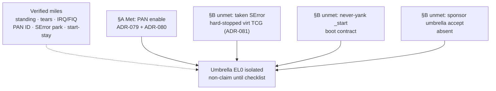

# ADR-060 — Isolation leftovers closure checklist for sponsor

- Status: Accepted (docs). Updated 2026-09-19 for [ADR-079](ADR-079-pan-cpu-reopen.md) / [ADR-080](ADR-080-pan-enable-fault.md) PAN CPU reopen + enable, and [ADR-081](ADR-081-taken-serror-reopen.md) / [ADR-082](ADR-082-b1-qemu-type-nmi.md) taken-SError re-probe (still blocked); 2026-09-25 [ADR-084](ADR-084-b2-free-runner-serror.md) B2 free-runner spike (blocked). **Sponsor-facing closure checklist** for isolation leftovers locked by [ADR-047](ADR-047-isolation-leftovers-decisions.md), [ADR-053](ADR-053-taken-serror-hard-stop.md), [ADR-054](ADR-054-pan-enable-lock.md), [ADR-055](ADR-055-el0-isolated-checklist.md), and [#98](https://github.com/artofdream/ctos/issues/98). Does **not** invent Verified for taken SError or “EL0 isolated.” Does **not** reopen Guest Linux / containers / immutable-OS marketing.
- Date: 2026-09-15
- **Follow-on (2026-09-26, M5):** draft accept [ADR-091](ADR-091-el0-isolated-accept-draft.md) (Draft / pending sponsor accept) proposes the exact umbrella sentence and scope, plus gaps G1–G3 for the sponsor to weigh. The umbrella row below is unchanged: Planned / non-claim.
- **Follow-on (2026-09-26, M4):** sponsor D1 accepted. The taken-SError evidence class for the umbrella is the B1 pin job (now **unconditional** on every push/PR) plus the B2-P one-off KVM run ([ADR-090](ADR-090-serror-evidence-class.md)). The stock-TCG hard-stop in the row below still holds for stock QEMU.
- **Follow-on (2026-09-26, M3):** sponsor D2 accepted. The umbrella's identity row now reads “full identity teardown except the documented `_start` stub page” ([ADR-089](ADR-089-start-stub-identity-exception.md)) and is Met on this session's evidence (ADR-087/088). Taken SError (D1 → ADR-090) and the sponsor accept (D4 → ADR-091 draft) are still open.
- **Follow-on (2026-09-26):** B2-P taken SError Verified opt-in on Graviton3 KVM ([ADR-085](ADR-085-b2p-graviton-kvm-serror.md)). Checklist audit + gap list + milestone plan + sponsor decisions D1–D5: [ADR-086](ADR-086-el0-isolated-checklist-audit.md). The umbrella stays non-claim, and the locks below are unchanged.
- Numbering note: next free after ADR-059 on `main` @ `404d74c`. FAT/fs-libctos sample already took **ADR-059**; this ADR is **060** (no collision with a parallel FAT-sample ADR-060).

## Context

Sponsor / DSO asked for a **single clear table** that closes the leftover *decision surface* after the isolation-gap locks (#98 / ADR-053–055): what is locked, what would be required for an honest Verified, what is blocked on the default smoke machine (`virt` + `-cpu cortex-a57`), and the reopen gates. This ADR cites those decisions; it does **not** rewrite them.

CloudAgent HELD. Docs-only. Prefer EVO-X2 / agent-box for docs build. Do not self-merge ([ADR-002](ADR-002-pr-identity-split.md)).

## Decision (cite locks; do not invent Verified)

The sponsor closure checklist is the table below. Status labels are **locks and reopen gates only**.

### Sponsor isolation leftovers closure checklist

| Leftover | Locked status | What’s required for honest Verified | What’s blocked on a57+virt today | Reopen gate |
| --- | --- | --- | --- | --- |
| **Taken lower-EL SError** while standing | **Deferred / non-goal (hard-stopped)** ([ADR-053](ADR-053-taken-serror-hard-stop.md) / [ADR-081](ADR-081-taken-serror-reopen.md) / [ADR-082](ADR-082-b1-qemu-type-nmi.md) / ADR-047 §1). `el0: serror-park` stays **Verified**. A-clear path = **dormant prep**. | Honest host inject that delivers **async SError** on the **accepted** smoke machine; serial `el0: serror` under EXPECT; new ADR citing working evidence. | QMP `inject-nmi` / HMP `nmi` → `machine does not provide NMIs` on QEMU 10 `virt` + `-cpu cortex-a76` (re-probed 2026-09-19; also a57 / GICv3 / `virtualization=on` / `max`). No silent invent. FEAT_NMI ≠ SError. KVM out of scope for TCG smoke. | ADR-081 Decision §4 **B1/B2/B3**: (B1) upstream/pinned QEMU virt `TYPE_NMI`→`ARM_CPU_SERROR` — research [ADR-082](ADR-082-b1-qemu-type-nmi.md): **no shippable pin 2026-09-19**; wait upstream or reviewed local pin; (B2) sponsor smoke-machine ADR with CI-runnable honest inject — spike [ADR-084](ADR-084-b2-free-runner-serror.md) 2026-09-25: **blocked** on free hosted runners (no arm64 KVM/HVF/WHPX); needs sponsor choice (self-hosted arm64 KVM / paid bare metal / wait); (B3) permanent non-goal. B1 opt-in pin Verified ([ADR-083](ADR-083-b1-qemu-nmi-pin.md)). |
| **PAN enable** (PSTATE.PAN + EL1-vs-EL0 fault) | **Verified** ([ADR-080](ADR-080-pan-enable-fault.md) / [#125](https://github.com/artofdream/ctos/issues/125) mile 2). Default `-cpu cortex-a76` → `pan: present` + `pan: enabled` + `pan: el1-fault`. Historical a57 `pan: absent` ([ADR-026](ADR-026-pan-capability.md) / [ADR-054](ADR-054-pan-enable-lock.md) / [ADR-079](ADR-079-pan-cpu-reopen.md)). | Met: EL1 load of EL0-accessible page faults with SPSR.PAN. | a57 alone cannot enable (historical). | ADR-054 gate 1–4 **met** (079+080). |
| **Umbrella “EL0 isolated”** (P-SEC-3l) | **Planned / non-claim until checklist** ([ADR-055](ADR-055-el0-isolated-checklist.md) / ADR-047 §4 / #98). Specific Verified miles ≠ this row. | **Every** ADR-055 §B Unmet row Met under its own ADR + probes, **plus** written sponsor accept that the umbrella sentence is in scope (ADR-048-style — **not** this file). | Under current constraints: no PAN enable on a57; `_start` stays; taken SError hard-stopped; no umbrella sponsor accept. Remaining miles after #98 = those §B blockers (not more Track A ladder work on virt+a57). | Path to Verified: clear §B under honest probes (and redesign boot if `_start` ever leaves identity — sponsor scope). Path to **permanent non-claim**: leave locks as-is; do not round Verified miles into the umbrella. |
| **Yank `_start`** (2026-09-26: the stub page is the one documented identity exception, [ADR-089](ADR-089-start-stub-identity-exception.md); all other identity is torn, see [ADR-087](ADR-087-identity-inventory-ratchet.md) / [ADR-088](ADR-088-mmio-high-alias.md)) | **Decided: never** while QEMU `-kernel` needs `0x4008_0000` ([ADR-042](ADR-042-isolation-leftover-wrap.md) / ADR-047 §3). `ident: start-stay` **Verified honesty**. | N/A under current boot contract — not a Verified target. | Boot stub must stay mapped at entry. | Only a future sponsor-scoped boot redesign ADR. **Never yank `_start`** in the meantime. |
| **Guest Linux / containers / immutable-OS marketing** | **Still out** ([ADR-029](ADR-029-containers-nongoal.md) / [ADR-036](ADR-036-linux-compat-decision.md) / ADR-055 honesty). | N/A — out of scope for this checklist. | Do not reopen via isolation docs. | Separate product ADR + sponsor scope if ever. |

### Explicit non-actions (this ADR)

- Do **not** invent Verified for taken SError / “EL0 isolated.”
- Do **not** silent `-cpu` switch (ADR-079 documented the cortex-a76 change).
- Do **not** yank `_start`.
- Do **not** reopen Guest Linux / containers / immutable-OS marketing.
- Do **not** require `el0: serror` in smoke. Smoke **does** require `pan: enabled` / `pan: el1-fault` (ADR-080).

## Verified ladder vs unmet §B (glance)

*≤12 nodes. Miles are not the umbrella. Unmet §B blocks Verified under current constraints.*

## Honesty

Say: “isolation leftovers are closed as **locks + reopen gates** (ADR-060); PAN enable is Verified (ADR-080); taken SError stays blocked after ADR-081 re-probe; EL0 isolated remains non-Verified.” Do **not** say:

- taken lower-EL SError is Verified
- “EL0 isolated” from PAN alone
- “EL0 isolated” / “secure OS” / “hardened isolation complete”
- `_start` was yanked / the kernel moved
- Guest Linux / containers / immutable-OS marketing as if isolation closed

## Consequences

- Docs: this ADR is the sponsor one-pager; [ADR-055](ADR-055-el0-isolated-checklist.md) remains the detailed §A/§B evidence table; [ADR-053](ADR-053-taken-serror-hard-stop.md) / [ADR-054](ADR-054-pan-enable-lock.md) remain the hard locks.
- Cross-links: [honesty-ledger.md](../framework/honesty-ledger.md), [el0.md](../framework/el0.md), [security.md](../framework/security.md) (threat-model **v1.35**), [roadmap.md](../04-roadmap/roadmap.md), [SUMMARY.md](../SUMMARY.md), [limits.md](../overview/limits.md).
- Code: unchanged. No `src/` edits. CloudAgent HELD. Do not self-merge.
