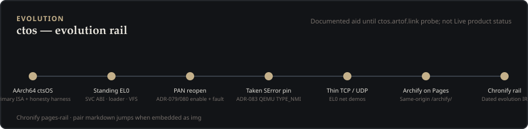

# Chronify — evolution rail

Dated milestones for **ctos** (ctsOS). Sister to [Archify diagrams](../archify/index.md).

| Artifact | Open |
| --- | --- |
| Pages rail (SVG) |  |
| Interactive HTML | [ctos-evolution.timeline.html](./ctos-evolution.timeline.html) |
| IR (source of truth) | [`ctos-evolution.timeline.json`](./ctos-evolution.timeline.json) |

## Honesty

**Documented** aid until [ctos.artof.link](https://ctos.artof.link/chronify/) Pages probe this session. Not Live product status. Does not claim umbrella "EL0 isolated."

Regenerate with [chronify](https://github.com/artofdream/chronify) v0.1.0:

```bash
node bin/chronify.mjs deliver timeline docs/chronify/ctos-evolution.timeline.json \
  docs/chronify/ctos-evolution-rail.svg --surface pages-rail
```
