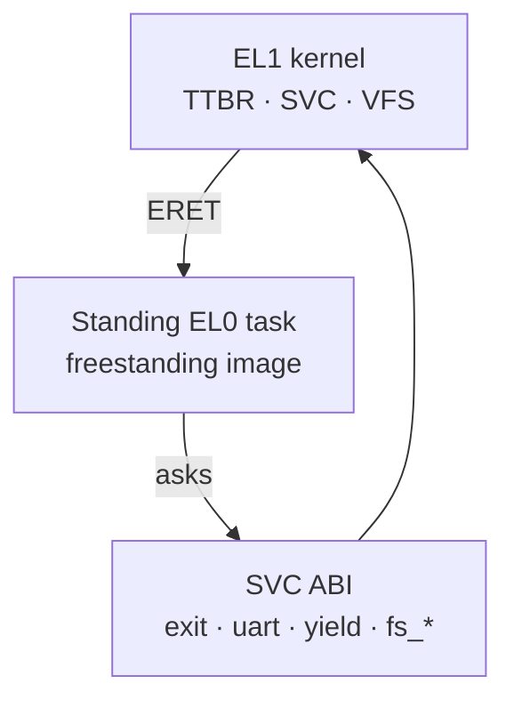
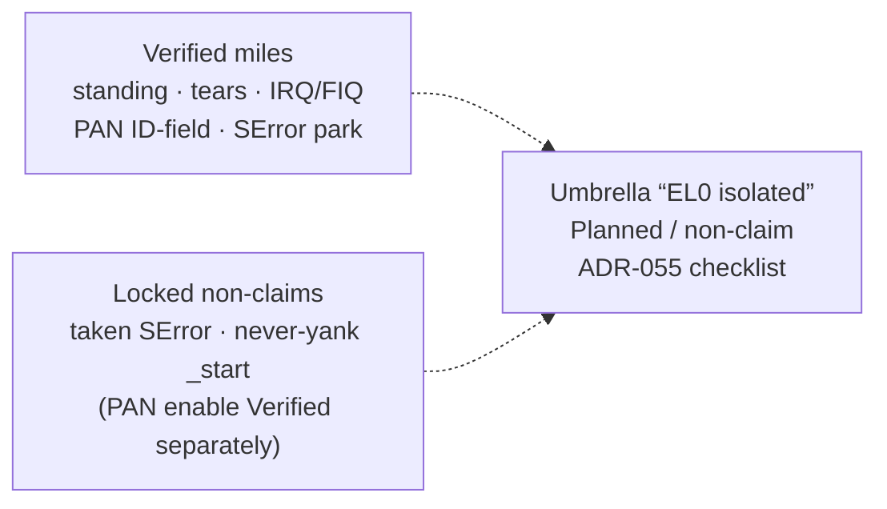

# EL0 isolation (P-SEC-3 / ADR-013)

**Isolation: Planned / non-claim until checklist** ([ADR-047](../03-adr/ADR-047-isolation-leftovers-decisions.md) / [ADR-055](../03-adr/ADR-055-el0-isolated-checklist.md); sponsor closure [ADR-060](../03-adr/ADR-060-isolation-leftovers-closure-checklist.md)). A first mile, a user-TTBR0 read mile, an ASID TLB mile, a standing EL0 context, a TTBR1 private-page first cut, an EL1 high-VA fetch mile, an identity-tear first cut, an identity `.text` range tear, a live identity `.text` tear after a high-VA vtable rewrite, an identity `.rodata` tear, a PAN ID-field probe (`pan: present` on cortex-a76 / ADR-079) and PAN enable + EL1-vs-EL0 fault (`pan: enabled` / `pan: el1-fault` / ADR-080), a **documented SVC ABI mile**, a **`libctos` CRT mile**, a **guest ELF PT_LOAD loader mile**, a **standing-task (normal mode) mile**, a **thin VFS + memfs mile**, a **virtio-blk + FAT16 mile**, and an **OS/app slot first cut** exist. Those miles alone are not the product claim. A8 is documented rebuild recipes ([what-can-run.md](../overview/what-can-run.md)). A9 is two artifacts + FAT `/hello` ([ADR-030](../03-adr/ADR-030-os-app-slots.md)); leftover cross-update / embed-off landed ([ADR-032](../03-adr/ADR-032-track-a-leftovers.md)). Product “app hosting is done” is **Verified** under [ADR-048](../03-adr/ADR-048-app-hosting-claim-criteria.md) / [ADR-052](../03-adr/ADR-052-sponsor-accept-app-hosting.md) (freestanding slots). Do not claim Linux userspace, POSIX, containers, or “EL0 isolated.” Standing enter/leave as a guest sample: [apps-today.md](apps-today.md). CRT + loader + standing-as-normal: [building-or-porting.md](building-or-porting.md).

Direction: [ADR-013](../03-adr/ADR-013-el0-isolation-direction.md). TTBR1 first cut: [ADR-016](../03-adr/ADR-016-ttbr1-private-page.md). EL1 fetch mile: [ADR-017](../03-adr/ADR-017-ttbr1-high-el1-exec.md). Identity-tear first cut: [ADR-018](../03-adr/ADR-018-identity-teardown-first-cut.md). Identity `.text` range tear: [ADR-019](../03-adr/ADR-019-identity-text-range-tear.md). Live `.text` tear: [ADR-020](../03-adr/ADR-020-identity-fnptr-reloc.md). Identity `.rodata` tear: [ADR-025](../03-adr/ADR-025-identity-rodata-tear.md). Identity `.data` tear: [ADR-037](../03-adr/ADR-037-identity-data-tear.md). Identity heap tear: [ADR-038](../03-adr/ADR-038-identity-heap-tear.md). Leftover identity RAM tear: [ADR-049](../03-adr/ADR-049-identity-ram-tear.md). EL0 entry without VMALLE1: [ADR-039](../03-adr/ADR-039-el0-entry-without-vmalle1.md). Lower-EL IRQ while standing: [ADR-040](../03-adr/ADR-040-lower-el-irq-standing.md). IRQ-unmasked default ERET: [ADR-041](../03-adr/ADR-041-irq-unmasked-default-eret.md). Isolation leftover wrap: [ADR-042](../03-adr/ADR-042-isolation-leftover-wrap.md). Lower-EL FIQ + SError park: [ADR-043](../03-adr/ADR-043-lower-el-fiq-serror.md). Taken SError QMP attempt: [ADR-045](../03-adr/ADR-045-taken-serror-qmp.md). Isolation leftovers decisions: [ADR-047](../03-adr/ADR-047-isolation-leftovers-decisions.md). Taken SError hard-stop: [ADR-053](../03-adr/ADR-053-taken-serror-hard-stop.md). Taken SError reopen (still blocked): [ADR-081](../03-adr/ADR-081-taken-serror-reopen.md) / [ADR-082](../03-adr/ADR-082-b1-qemu-type-nmi.md). PAN enable lock: [ADR-054](../03-adr/ADR-054-pan-enable-lock.md). Umbrella checklist: [ADR-055](../03-adr/ADR-055-el0-isolated-checklist.md). Sponsor leftovers closure: [ADR-060](../03-adr/ADR-060-isolation-leftovers-closure-checklist.md). App hosting claim criteria: [ADR-048](../03-adr/ADR-048-app-hosting-claim-criteria.md). PAN capability: [ADR-026](../03-adr/ADR-026-pan-capability.md). SVC ABI: [ADR-021](../03-adr/ADR-021-svc-syscall-abi.md) / [syscall.md](syscall.md). CRT / `libctos`: [ADR-022](../03-adr/ADR-022-libctos-crt.md). Guest loader: [ADR-023](../03-adr/ADR-023-elf-pt-load-loader.md). Standing-as-normal: [ADR-024](../03-adr/ADR-024-standing-el0-normal.md). Thin VFS + memfs: [ADR-027](../03-adr/ADR-027-thin-vfs-memfs.md). Threat model: [security.md](security.md). Code: `src/el0.rs`, `src/syscall.rs`, `src/libctos.rs`, `src/loader.rs`, `src/vfs.rs`, `libctos/`, `src/asid.rs`, `src/ttbr1.rs`, `src/teardown.rs`, `src/pan.rs`.

*Standing EL0 + SVC is a Verified mile class. It is not a Linux process and not “EL0 isolated.”*

*Miles are not the umbrella. Do not round Verified probes into “EL0 isolated.”*

## What exists today

- Kernel runs at EL1 (`SPSel = 0`).
- One map-window page (`paging::EL0_PAGE`) can be UXN-clear / PXN for a trampoline or standing payload.
- `ERET` to EL0 switches to a **user TTBR0** (`L1_USER`, ASID=1) that maps kernel text/rodata + the exception stack + the trampoline window (every 2 MiB those ranges occupy), and **omits** `.data` / `.bss` / heap. The lower-EL handler restores kernel TTBR0 from `TPIDR_EL1` before touching kernel data. After identity `.data`/heap tear, that path is `MSR TTBR0` + `ISB` only — no `TLBI VMALLE1` ([ADR-039](../03-adr/ADR-039-el0-entry-without-vmalle1.md); serial `el0: no-vmalle1`).
- Dual EL1 ASIDs (1 vs 2) with `nG` probe pages switch **without** `TLBI VMALLE1` (`src/asid.rs`).
- A bounded **standing** user context on that TTBR0: `SVC #1` stays at EL0 (`el0: standing`), user `MOVZ` runs, `SVC #2` restores EL1 (`el0: restored`). `is_active()` is true only for that lifetime. That dual-SVC is the ADR-013 probe.
- A **standing task** (A4 / ADR-024) is the supported path for a loaded freestanding image: the A3 loader maps `PT_LOAD`, `is_active()` is true while it runs, `yield` / `uart_write` stay at EL0 (`el0: task-active`), `exit` restores (`el0: task-exit` / `el0: task-restored`). An unexpected lower-EL sync restores fail-closed (`el0: restore-fail`) instead of parking. That is the ctos process model ([ADR-035](../03-adr/ADR-035-process-model-standing-el0.md)) — not Linux `fork` / `execve` / `wait`.
- TTBR1 walks are enabled. One kernel-private high page (`TTBR1_PRIV`) is EL1-only; EL0 load faults. Identity RAM is aliased at `va + TTBR1_BASE` via **cloned** RAM tables; EL1 can fetch a real path there and `VBAR_EL1` is the high alias. After a high-VA jump, rustc vtables are rewritten to high aliases (`ident: reloc`) and live identity `.text` after the boot stub is unmapped (`ident: live`), plus the dedicated 16 KiB range (`ident: range` / `ident: ok`). Identity `.rodata` is unmapped after a pointer rewrite (`ident: rodata` / `ident: rodata-fault` / `ident: rodata-high`). Identity `.data`/stacks are unmapped after SP relocate (`ident: data`). Identity heap is unmapped after high `GlobalAlloc` VAs (`ident: heap`). `_start` / QEMU `-kernel` stay at `0x4008_0000` (`ident: start-stay`, [ADR-042](../03-adr/ADR-042-isolation-leftover-wrap.md)). Leftover identity frames after the heap are unmapped (`ident: ram` / `ident: ram-fault` / `ident: ram-high`, [ADR-049](../03-adr/ADR-049-identity-ram-tear.md)); high twins stay. **Never yank `_start`** while `-kernel` needs that address ([ADR-047](../03-adr/ADR-047-isolation-leftovers-decisions.md)). PAN ID field is printed (`pan: present` on `-cpu cortex-a76`, [ADR-079](../03-adr/ADR-079-pan-cpu-reopen.md); historical a57 `pan: absent`); PAN **enable** + EL1-vs-EL0 fault is Verified ([ADR-080](../03-adr/ADR-080-pan-enable-fault.md)).
- Lower-EL AArch64 **sync** handles `SVC` (ADR-013 probes `#0`/`#1`/`#2` plus public ABI `#16`–`#23`), a kernel-data IABORT, a kernel-data DABORT, and the TTBR1 private-page DABORT, then returns to EL1t (or stays at EL0 on standing `SVC #1` / `SYS_YIELD` / `SYS_UART_WRITE` / memfs SVCs). Lower-EL **IRQ** while standing handles the timer (or other) IRQ, then returns to EL0 (`el0: irq`, [ADR-040](../03-adr/ADR-040-lower-el-irq-standing.md)); default standing/task `ERET` clears IRQ mask (`el0: irq-default`, [ADR-041](../03-adr/ADR-041-irq-unmasked-default-eret.md)). Lower-EL **FIQ** while standing is taken when GICC FIQEn is armed (`el0: fiq`, [ADR-043](../03-adr/ADR-043-lower-el-fiq-serror.md)). ADR-045 wires an A-clear standing SError probe (`el0: serror-arm` / `eret_to_el0_serror`); QEMU 10 virt TCG (a57 and a76) has no working host inject ([ADR-081](../03-adr/ADR-081-taken-serror-reopen.md) / [ADR-082](../03-adr/ADR-082-b1-qemu-type-nmi.md)), so hello keeps `el0: serror-park`. Short non-standing trampoline probes stay IRQ-masked. Default standing SPSR still masks FIQ and SError except the dedicated probes.
- Public SVC ABI ([syscall.md](syscall.md)): `exit` / `uart_write` / `yield` plus memfs `fs_*` (19–23). A `libctos` CRT wraps those numbers; a hello payload is copied onto the standing EL0 page (A2) and also parsed as ELF64 `PT_LOAD` on the guest (A3). A4 runs that loaded image as a standing task until `exit`. A6 is in-RAM memfs. ABI + CRT + loader + standing-task + memfs miles. App hosting Planned.

## Probed miles

| Probe | What closes it | Honesty |
| --- | --- | --- |
| EL0 entered and returned | Serial `el0: svc` + `el0: ok`; `#[test_case]` `el0_svc_roundtrip` | Entered and left. Not a user process. |
| EL0 cannot execute kernel data | Serial `el0: nx kernel`; `#[test_case]` `el0_cannot_execute_kernel_data` | IABORT on `.data` (UXN and/or unmapped). Not isolation. |
| User TTBR0 omits kernel `.data` | Walk `L1_USER`; `#[test_case]` `user_ttbr0_omits_kernel_data` | Distinct user table. Text is still mapped so the handler can run. |
| EL0 cannot *read* kernel `.data` | Serial `el0: no kernel read`; `#[test_case]` `el0_cannot_read_kernel_data` | Translation/permission DABORT. Not PAN. |
| Standing EL0 context | Serial `el0: standing` / `el0: restored`; `#[test_case]` `standing_el0_enter_leave` | Real enter/leave on user TTBR0. `is_active()` true only while standing. Not POSIX. Default `ERET` clears IRQ mask (ADR-041). |
| Standing EL0 as normal mode | Serial `el0: task-enter` / `el0: task-active` / `el0: task-exit` / `el0: task-restored` / `el0: restore-fail` / `el0: task-ok`; `#[test_case]` `standing_task_runs_until_exit` + `standing_task_fault_restores` | Loaded A3 image until `exit`. Fail-closed restore. Not POSIX. Not isolation. |
| ASID field programmed | `user_ttbr0() >> 48 == 1` | Programming fact on the EL0 trampoline. Not the isolation mile. |
| ASID isolation | Serial `asid: dual` / `asid: conflict` / `asid: ok`; `#[test_case]` `asid_isolation_without_vmalle1` | Dual TTBR0 without `TLBI VMALLE1`. Stale ASID-1 data under ASID 2 is Failed. Not “EL0 isolated.” |
| TTBR1 private page | Serial `ttbr1: el1` / `ttbr1: no el0` / `ttbr1: ok`; `#[test_case]` `ttbr1_el1_sees_priv_el0_does_not` | EL1-only high page. Not a relocated kernel. |
| EL1 fetch from TTBR1 high VA | Serial `ttbr1: el1 exec` / `ttbr1: vbar`; `#[test_case]` `el1_executes_from_ttbr1_high_va` | Real EL1 path + high VBAR. Identity boot stub stays. |
| Identity-tear first cut | Serial `ident: split` / `ident: fault` / `ident: high` / `ident: no el0` / `ident: ok`; `#[test_case]` `identity_tear_el1_faults_high_stays` | One identity text page unmapped; high twin still fetches. Not a relocated kernel. Full teardown Planned. |
| Identity text range tear | Serial `ident: jump` / `ident: range` / `ident: text`; `#[test_case]` `identity_text_range_unmapped_boot_stub_stays` | High-VA continuation + 16 KiB dedicated range unmapped; high twins still fetch. Not a relocated kernel. |
| High-VA vtable rewrite + live `.text` tear | Serial `ident: reloc` / `ident: live`; `#[test_case]` `identity_fn_ptrs_rewritten_high` + `live_identity_text_unmapped_boot_stub_stays` | rustc `dyn Write` / fmt tables patched to high aliases; live identity `.text` after `_start` unmapped; `println!` still runs. Not a relocated kernel. |
| Identity `.rodata` tear | Serial `ident: ro-reloc` / `ident: rodata` / `ident: rodata-fault` / `ident: rodata-high`; `#[test_case]` `identity_rodata_unmapped_high_stays` | Identity `.rodata` unmapped; high twin still loads. Not a relocated kernel. |
| Identity `.data` / stack tear | Serial `ident: data-reloc` / `ident: data` / `ident: data-fault` / `ident: data-high`; `#[test_case]` `identity_data_torn_high_stays` | Identity `.data`/stacks unmapped; SP high-only ([ADR-037](../03-adr/ADR-037-identity-data-tear.md)). Not a relocated kernel. |
| Identity heap tear | Serial `ident: heap-reloc` / `ident: heap` / `ident: heap-fault` / `ident: heap-high`; `#[test_case]` `identity_heap_torn_high_stays` | Identity heap unmapped; `GlobalAlloc` returns high VAs ([ADR-038](../03-adr/ADR-038-identity-heap-tear.md)). Not a relocated kernel. |
| EL0 entry without full TLBI | Serial `el0: no-vmalle1`; `#[test_case]` `el0_entry_without_vmalle1`; `src/exception.rs` has no `tlbi vmalle1` | Standing/EL0 trampoline is MSR TTBR0 + ISB only after ADR-037/038 ([ADR-039](../03-adr/ADR-039-el0-entry-without-vmalle1.md)). Not “EL0 isolated.” |
| Lower-EL IRQ while standing | Serial `el0: irq`; `#[test_case]` `lower_el_irq_while_standing` | Timer IRQ taken from standing EL0 and returned ([ADR-040](../03-adr/ADR-040-lower-el-irq-standing.md)). FIQ/SError still park. Not “EL0 isolated.” |
| IRQ-unmasked default ERET | Serial `el0: irq-default`; `#[test_case]` `lower_el_irq_default_eret` | Standing/task default `ERET` clears I ([ADR-041](../03-adr/ADR-041-irq-unmasked-default-eret.md)). Short non-standing probes stay masked. Not “EL0 isolated.” |
| Lower-EL FIQ while standing | Serial `el0: fiq`; `#[test_case]` `lower_el_fiq_while_standing` | Timer as FIQ via temporary GICC FIQEn ([ADR-043](../03-adr/ADR-043-lower-el-fiq-serror.md)). Default SPSR still masks F. Not “EL0 isolated.” |
| SError park honesty | Serial `el0: serror-park` | No working SError inject on virt TCG ([ADR-043](../03-adr/ADR-043-lower-el-fiq-serror.md) / [ADR-045](../03-adr/ADR-045-taken-serror-qmp.md) / [ADR-081](../03-adr/ADR-081-taken-serror-reopen.md) / [ADR-082](../03-adr/ADR-082-b1-qemu-type-nmi.md)). Taken path deferred/non-goal ([ADR-047](../03-adr/ADR-047-isolation-leftovers-decisions.md)). Not “EL0 isolated.” |
| Taken SError QMP attempt | Serial `el0: serror-arm` + host QMP log; taken `el0: serror` only if inject works | Guest A-clear path wired ([ADR-045](../03-adr/ADR-045-taken-serror-qmp.md)). QMP `inject-nmi` fails on QEMU 10 virt+a76 (ADR-081). No `#[test_case]`. Not “EL0 isolated.” |
| Identity `_start` stay | Serial `ident: start-stay`; `#[test_case]` `identity_boot_stub_stays_while_live_torn` | Honesty ([ADR-042](../03-adr/ADR-042-isolation-leftover-wrap.md) / [ADR-047](../03-adr/ADR-047-isolation-leftovers-decisions.md)): stub stays while live image + heap + leftover RAM are torn. Not “EL0 isolated.” |
| Leftover identity RAM tear | Serial `ident: ram` / `ident: ram-fault` / `ident: ram-high`; `#[test_case]` `identity_ram_torn_high_stays` | Optional mile taken ([ADR-049](../03-adr/ADR-049-identity-ram-tear.md)). High twin stays. Not a relocated kernel. Not “EL0 isolated.” |
| PAN ID field | Serial `pan: id=` / `pan: present`; `#[test_case]` `pan_present_on_probe_cpu` | `ID_AA64MMFR1_EL1.PAN != 0` on `-cpu cortex-a76` ([ADR-079](../03-adr/ADR-079-pan-cpu-reopen.md)). Historical a57 `pan: absent`. |
| PAN enable + EL1-vs-EL0 fault | Serial `pan: enabled` / `pan: el1-fault`; `#[test_case]` `pan_enable_el1_fault_on_probe_cpu` | PSTATE.PAN set; EL1 load of EL0-accessible page faults ([ADR-080](../03-adr/ADR-080-pan-enable-fault.md)). Not “EL0 isolated.” |
| SVC ABI (`exit` / `uart_write` / `yield`) | Serial `svc: yield` / `svc: user-hi` / `svc: uart` / `svc: exit` / `svc: ok`; `#[test_case]` `el0_svc_abi_yield_uart_exit` + kernel-`.data` / TTBR1-alias reject | Documented numbers 16–18. Not Linux. Not app hosting. |
| `libctos` CRT | Serial `libctos: hi` / `libctos: ok` / `libctos: linked`; `#[test_case]` `libctos_hello_yield_uart_exit` | Linked wrappers, not a hand-encoded trampoline. Not app hosting. |
| Guest ELF PT_LOAD loader | Serial `loader: mapped` / `loader: ok`; `#[test_case]` `loader_maps_hello_and_erets` | Guest parse + map into user TTBR0 + `ERET` to `e_entry`. Not a Linux ABI. Not app hosting. |
| Thin VFS + memfs | Serial `fs: create` / `fs: write` / `fs: read` / `fs: el0` / `fs: ok`; `#[test_case]` `vfs_memfs_create_write_read_close` + `el0_fs_svc_roundtrip` | In-RAM named buffers. Not POSIX. Not FAT. Not app hosting. |
| OS/app slot first cut | Serial `slot: fat` / `slot: mapped` / `slot: ok`; `#[test_case]` `slot_load_from_fat_erets` | A9 ([ADR-030](../03-adr/ADR-030-os-app-slots.md)). FAT `/hello` + A3 map. A2–A4 load FAT (no production embed, [ADR-032](../03-adr/ADR-032-track-a-leftovers.md)). Product freestanding hosting Verified under ADR-048/052 (this mile alone ≠ Linux hosting). |

## Still Planned / decided leftovers (isolation) — [ADR-047](../03-adr/ADR-047-isolation-leftovers-decisions.md) / locks [ADR-053](../03-adr/ADR-053-taken-serror-hard-stop.md)–[ADR-055](../03-adr/ADR-055-el0-isolated-checklist.md) / sponsor closure [ADR-060](../03-adr/ADR-060-isolation-leftovers-closure-checklist.md)

| Item | Status | Notes |
| --- | --- | --- |
| PAN enable | **Verified** ([ADR-080](../03-adr/ADR-080-pan-enable-fault.md)) | Still not the umbrella ([ADR-055](../03-adr/ADR-055-el0-isolated-checklist.md)). |
| Yank `_start` | **Decided: never** while QEMU `-kernel` needs `0x4008_0000` | `ident: start-stay` Verified honesty ([ADR-042](../03-adr/ADR-042-isolation-leftover-wrap.md)). |
| Leftover identity RAM after heap | **Verified** (optional mile) | `ident: ram*` ([ADR-049](../03-adr/ADR-049-identity-ram-tear.md)). Not required for the umbrella row; umbrella still Planned/non-claim. |
| Taken lower-EL SError on this smoke machine | **Deferred / non-goal (hard-stopped)** | Park Verified; A-clear dormant prep ([ADR-045](../03-adr/ADR-045-taken-serror-qmp.md)). Hard-stop [ADR-053](../03-adr/ADR-053-taken-serror-hard-stop.md); reopen re-probe [ADR-081](../03-adr/ADR-081-taken-serror-reopen.md) / [ADR-082](../03-adr/ADR-082-b1-qemu-type-nmi.md). Unlock = B1/B2/B3; B1 research ADR-082 (no shippable pin 2026-09-19). Do not claim taken Verified. |
| Umbrella “EL0 isolated” | **Planned / non-claim until checklist** | Checklist [ADR-055](../03-adr/ADR-055-el0-isolated-checklist.md); sponsor one-pager [ADR-060](../03-adr/ADR-060-isolation-leftovers-closure-checklist.md). Constraints: `_start` stays; taken SError hard-stopped; PAN enable Verified separately but not the umbrella. Specific miles are not this row. |
| Product app hosting “done” | **Verified** | [ADR-048](../03-adr/ADR-048-app-hosting-claim-criteria.md) Met×5 / [ADR-052](../03-adr/ADR-052-sponsor-accept-app-hosting.md). Freestanding slots only — not Linux/POSIX/containers. |

Unprobed stays **Unknown**. Do not say “EL0 works,” “EL0 isolated,” “Linux app host,” or “the kernel moved.” The freestanding ADR-048 product claim is Verified separately.

## Taken SError research + QMP attempt + hard-stop + reopen (ADR-044 / ADR-045 / ADR-047 / ADR-053 / ADR-081)

Taken lower-EL SError on this smoke machine is **deferred / non-goal (hard-stopped)** ([ADR-053](../03-adr/ADR-053-taken-serror-hard-stop.md) / [ADR-081](../03-adr/ADR-081-taken-serror-reopen.md) / [ADR-082](../03-adr/ADR-082-b1-qemu-type-nmi.md) / [ADR-047](../03-adr/ADR-047-isolation-leftovers-decisions.md)). Research ([ADR-044](../03-adr/ADR-044-taken-serror-research.md)) recommended QMP/`nmi`; [ADR-045](../03-adr/ADR-045-taken-serror-qmp.md) wired the guest A-clear path and attempted QMP — QEMU 10 virt reports `machine does not provide NMIs`. Re-probed **2026-09-14** (a57) and **2026-09-19** (default a76 + GICv3/`virtualization=on`/`max`): same error. Unlock = ADR-081 B1/B2/B3; B1 research ADR-082 (no shippable pin 2026-09-19). `el0: serror-park` stays Verified; A-clear stays dormant prep. Do not claim taken SError Verified.

## Umbrella “EL0 isolated” checklist (ADR-055) / sponsor closure (ADR-060)

Umbrella isolation stays **Planned / non-claim until checklist**. Verified miles vs unmet requirements: [ADR-055](../03-adr/ADR-055-el0-isolated-checklist.md). Sponsor-facing closure table (locks + reopen gates only): [ADR-060](../03-adr/ADR-060-isolation-leftovers-closure-checklist.md). Unmet blockers include taken SError ([ADR-053](../03-adr/ADR-053-taken-serror-hard-stop.md) / [ADR-081](../03-adr/ADR-081-taken-serror-reopen.md) / [ADR-082](../03-adr/ADR-082-b1-qemu-type-nmi.md)), never-yank `_start`, and umbrella sponsor accept (PAN enable is Met separately via [ADR-080](../03-adr/ADR-080-pan-enable-fault.md)). Do not round Verified miles into “EL0 isolated.”