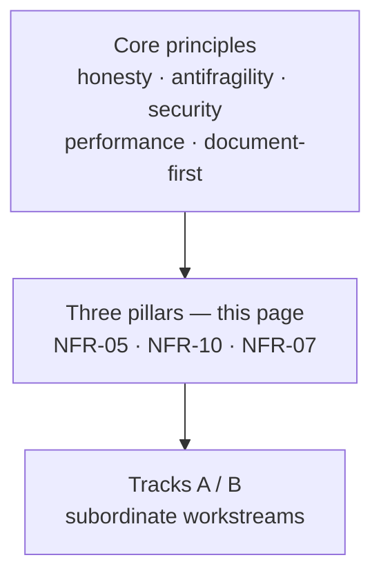

# Three pillars

After the cooperative scheduler (M9), ctos treats **antifragility**, **security**, and **performance** as first-class pillars ([ADR-011](../03-adr/ADR-011-three-pillars.md)). In everyday words: we turn repeated misses into sensors, we prove security slices instead of saying “secure OS,” and we measure before we tune. They share one rule: a status word needs a probe ([honesty ledger](honesty-ledger.md)).

**Principles drive; pillars sit under them; tracks sit under both.** Visitor-facing list: [landing — Driving principles](../index.md#driving-principles). In-repo list: [principles.md](principles.md). This page is the deep hub, not a second marketing copy. Extra stance: [overview.md](overview.md), [apps-today.md](apps-today.md), [building-or-porting.md](building-or-porting.md), [immutability.md](immutability.md).

*Tracks (loader/ABI, later slots/FS) do not outrank a principle.*

| Pillar | Frozen ID | Home | What “done” looks like |
| --- | --- | --- | --- |
| Antifragility | [NFR-05](../02-requirements/fr-nfr.md) | [antifragility.md](antifragility.md) | Repeated failures become sensors/gates, not extra README advice |
| Security | [NFR-10](../02-requirements/fr-nfr.md) | [security.md](security.md) | Threat-model v1.29 + probes before any “secure OS” claim. EL0 miles: [el0.md](el0.md) (umbrella isolation Planned/non-claim per [ADR-047](../03-adr/ADR-047-isolation-leftovers-decisions.md); standing + TTBR1 first cut + EL1 high-VA fetch + identity `.text` range tear + live `.text` tear + identity `.rodata`/`.data`/heap tears + PAN ID-field + ASID + SVC ABI + libctos CRT + memfs + FAT16 + A9 slot first cut / cross-update / embed-off are separate rows). App hosting: [syscall.md](syscall.md) / [ADR-048](../03-adr/ADR-048-app-hosting-claim-criteria.md) / [ADR-052](../03-adr/ADR-052-sponsor-accept-app-hosting.md) (product claim Verified under Met×5; not Linux/POSIX/containers) |
| Performance | [NFR-07](../02-requirements/fr-nfr.md) | [performance.md](performance.md) | Measurable CNTPCT + IRQ-delta + host ELF size + boot-delta; optimize only with a probe |

Bring-up M0–M9 stays on the [roadmap](../04-roadmap/roadmap.md). Pillar work after M9 is listed there as a separate section so a docs PR does not pretend to close paging or a scheduler.

Immutability is the same rule: **scoped** RO+NX / text-tear probes are fine; **absolute** “immutable OS” is not. Overview: [Advantages — Immutability](../overview/advantages.md#immutability).

Do not import florist / AEA role names. These pillars are ctos-native.
