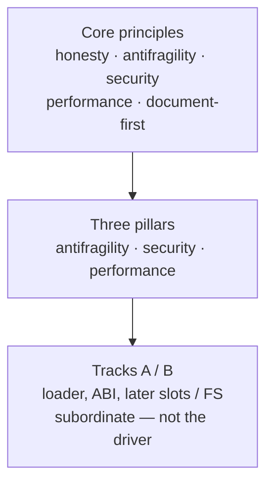
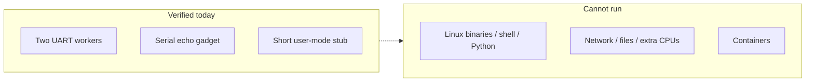
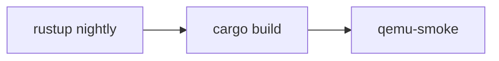

# ctos (ctsOS)

**ctos** is a small operating-system **kernel** you can study. It is written in Rust for 64-bit ARM (**AArch64**). You run it in the **QEMU** emulator, not as a desktop or phone OS. The nickname **ctsOS** is only for display; the repo and crate stay `ctos`.

This book **is** the website. The same markdown lives under `docs/` in [the GitHub repo](https://github.com/artofdream/ctos). There is no second marketing copy.

It is **not** a product site. Do not say “secure OS,” “production ready,” or “EL0 isolated.” Status words need a [probe](framework/honesty-ledger.md).

## What it is

ctos boots under QEMU’s `virt` machine and prints on a serial port (the **PL011 UART**). After that it grows one honest mile at a time: exceptions, paging, a heap, a tiny scheduler, then measured security and performance cuts.

**Core principles drive.** Roadmap tracks (A = loader and syscall ABI, B = later slots and a filesystem) are **subordinate**. A track does not outrank a principle.

Primary path: QEMU `virt` + UART ([ADR-003](03-adr/ADR-003-primary-isa-aarch64.md)). Frozen requirement IDs: [FR-01–FR-15 and NFR-01–NFR-14](02-requirements/fr-nfr.md).

## Driving principles

Everyday meaning first; frozen IDs second. Same list as the [pillars hub](framework/pillars.md). This landing is the visitor-facing source. `docs/framework/` stays for deep links — do not keep a second marketing copy.

| Principle | In everyday words | Frozen ID |
| --- | --- | --- |
| **Honesty** | If we did not run a check, we do not say it works. Unprobed stays **Unknown**. | [NFR-06](02-requirements/fr-nfr.md) · [ledger](framework/honesty-ledger.md) |
| **Antifragility** | The same miss twice becomes an automated sensor, not another README paragraph. | [NFR-05](02-requirements/fr-nfr.md) · [Antifragility](framework/antifragility.md) |
| **Security** | Write down what we fear, then prove a slice. Not a “secure OS” slogan. | [NFR-10](02-requirements/fr-nfr.md) · [Security](framework/security.md) |
| **Performance** | Measure a known path first. No invented benches. | [NFR-07](02-requirements/fr-nfr.md) · [Performance](framework/performance.md) |
| **Document-first** | Write the decision, then the code. One milestone → one branch → one PR. | [FR-14](02-requirements/fr-nfr.md) / [NFR-13](02-requirements/fr-nfr.md) |



*Principles sit above pillars. Tracks sit below both. A1–A4 are ABI + CRT + loader + standing-task miles only. Not a claim that Track A hosting is built.*

## What runs today

Three samples that already have probes. Details: [What can run today](overview/what-can-run.md).

1. **Two kernel tasks that take turns** — they print on the serial port and yield. Not preemptive. Not two CPUs.
2. **A serial echo gadget** — one byte in, a line out. No terminal, no line editor.
3. **A short lower-privilege stub** — a few instructions in the CPU’s user mode, including the A1 SVC ABI trip, an A2 `libctos` hello, an A3 guest `PT_LOAD` of that same hello, and an A4 standing **task** until `exit` (`exit` / `uart_write` / `yield`), then a call back into the kernel. **Not a process.** No libc, no files, no apps.

**Cannot run:** Linux programs, a shell, Python, network servers, POSIX filesystem apps, extra CPUs, or containers (guest OCI/Docker is a **non-goal**).



*Left side matches existing smoke markers. Right side is out of scope. Do not say “apps run.”*

## How to build

You need nightly Rust and QEMU. Pages is **not** required for kernel work. Full list: [Prerequisites](overview/prerequisites.md).

```bash
rustup toolchain install nightly
rustup component add rust-src llvm-tools-preview
cargo build                 # ELF at target/aarch64-ctos/debug/ctos
./scripts/qemu-smoke.sh     # fail-closed serial + tests
```



*That rebuilds the **kernel**, including any in-tree code you add. It is not “port an app.”*

## Read next

| If you want… | Go here |
| --- | --- |
| What is in vs out | [What can run today](overview/what-can-run.md) · [Drawbacks / limits](overview/limits.md) |
| Why POSIX does not port | [Building or porting](overview/porting.md) |
| Files (memfs + FAT16) | [Filesystem](overview/filesystem.md) |
| App host / containers | [Hosting apps](overview/hosting-apps.md) — containers: **non-goal** ([ADR-029](03-adr/ADR-029-containers-nongoal.md)) |
| How we measure | [KPIs](overview/measure.md) |
| Why the repo is run this way | [Advantages](overview/advantages.md) |
| Deep dives | [Vision](01-vision/product-vision.md) · [FR / NFR](02-requirements/fr-nfr.md) · [Architecture](02-architecture/technical-architecture.md) · [Roadmap](04-roadmap/roadmap.md) · [Ledger](framework/honesty-ledger.md) |

Kernel build notes also live in the [GitHub README](https://github.com/artofdream/ctos#readme).

## URLs

| URL | Honesty |
| --- | --- |
| `https://ctos.artof.link` | **Verified.** HTTPS 200, cert for this name, landing shows Driving principles. Main deploy [34653046584](https://github.com/artofdream/ctos/actions/runs/34653046584) after #30. |
| `https://artofdream.github.io/ctos` | **Redirect.** This path (no trailing slash) 301s to the custom domain. A trailing slash 404’d on the 2026-09-11 probe — do not treat github.io as a second live tree. |

Publish mechanics: [Docs website + DNS](website.md).
