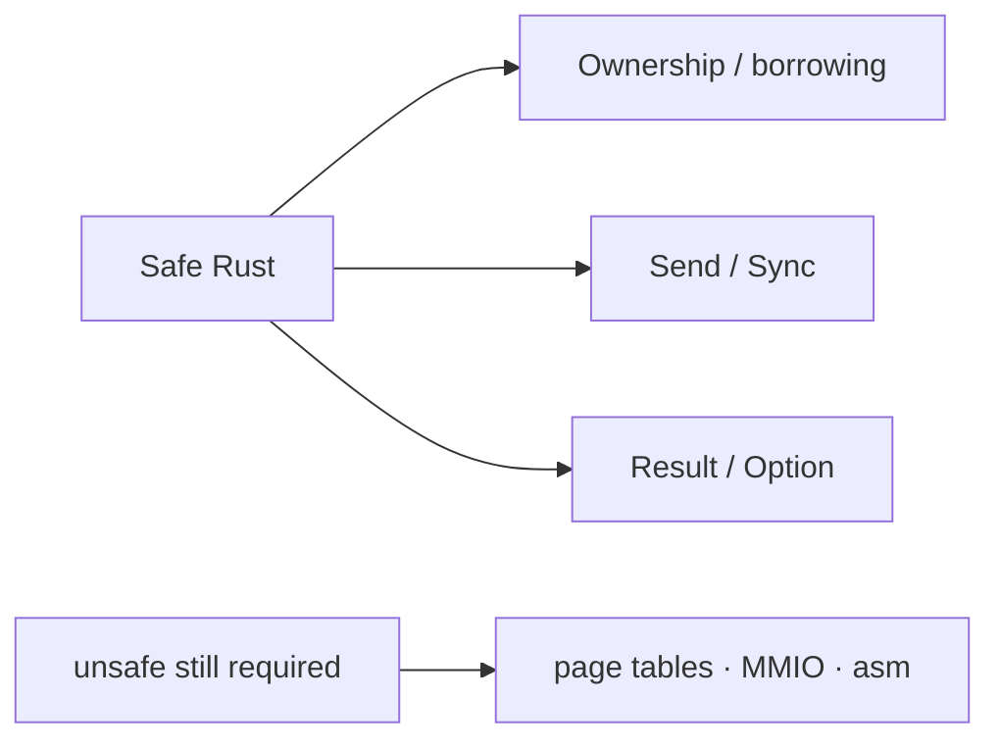

# Advantages

These are properties of **how the repo is run**, not a product pitch. They are useful if you want a small AArch64 kernel you can study without inflated status.

The landing **Driving principles** block (honesty, antifragility, security, performance, document-first) is the force; Track A/B stay subordinate. Visitor-facing source: [landing](../index.md#driving-principles). Deep pillar notes: [pillars.md](../framework/pillars.md).

## Document-first

Vision → architecture → ADR → roadmap stay ahead of code for each loop (document-first — [FR-14](../02-requirements/fr-nfr.md), [NFR-13](../02-requirements/fr-nfr.md)). Frozen IDs are [FR-01–FR-15 and NFR-01–NFR-14](../02-requirements/fr-nfr.md). New IDs are not invented in chat.

## Probed claims

Status words need a command, a serial capture, a `gh run` URL, or a file read that matches the claim (honesty — [NFR-06](../02-requirements/fr-nfr.md), [honesty ledger](../framework/honesty-ledger.md)). Unprobed stays **Unknown**. That is slower to write and harder to game than a green README badge.

## QEMU `virt` learning scope

Primary ISA is AArch64 on QEMU `virt` + serial UART ([ADR-003](../03-adr/ADR-003-primary-isa-aarch64.md)). The scope is small on purpose: UART, exceptions, paging, heap, a cooperative scheduler, then pillar cuts. It is not a distro and not a board bring-up until a board probe exists.

## Why Rust (for this kernel)

Rust is the language of this kernel on purpose. It is not a slogan. It is a tools-and-rules choice for a small AArch64 guest you can study.

1. **Memory safety by default.** Ownership and borrowing catch many C-class bugs (use-after-free, double-free, many buffer overruns) at **compile time**, before the guest boots.
2. **No garbage collector, still systems-friendly.** You keep control of layout and when things free. There is no stop-the-world collector in the way of a freestanding kernel.
3. **Safer concurrency relative to unchecked shared mutable state.** In safe Rust, `Send` / `Sync` make “who can share this across threads” a type-system question. That does not invent a scheduler; it reduces a class of data races in safe code.
4. **Zero-cost abstractions and fail-closed paths.** You can keep thin wrappers without paying for them at runtime. `Result` / `Option` push “did this fail?” into the type, which fits probed, fail-closed sensors better than silent `null`.
5. **Modern freestanding tooling.** `cargo`, `no_std`, and crates like in-tree `libctos` are the everyday build path ([prerequisites](prerequisites.md), [porting](porting.md)).

*Safe Rust helps discipline. `unsafe` is still how you talk to the machine.*

### Honesty caveats

- **`unsafe` still exists** for page tables, MMIO, and assembly. The type system does not cover those edges.
- Rust **does not invent a correct architecture** by itself. Wrong maps, wrong EL, and wrong ABI stay wrong.
- This does **not** mean “secure OS,” “EL0 isolated,” PAN enabled, or taken SError **Verified**. Those are separate probe rows ([limits](limits.md), [honesty ledger](../framework/honesty-ledger.md)).
- Status words still need **probes** / the honesty ledger. Language choice is not a substitute for a serial capture or a `gh run` URL.

Pair with [Drawbacks / limits](limits.md): Rust helps discipline; it does not remove those limits.

## Three pillars as requirements

After the cooperative scheduler (M9), antifragility, security, and performance are first-class ([ADR-011](../03-adr/ADR-011-three-pillars.md), [pillars.md](../framework/pillars.md)). They still need probes. “Secure” and “fast” are not default adjectives.

## Author ≠ merger

[ADR-002](../03-adr/ADR-002-pr-identity-split.md): the author does not merge their own PR. `artofdream` vs `cursor[bot]`. Same-login Approve is still self-review.

## Fail-closed sensors

`scripts/qemu-smoke.sh` and `force-fail` are meant to break when a marker disappears. Repeated host misses become ratchets, not extra paragraphs of advice ([antifragility.md](../framework/antifragility.md)).

## Immutability

**Scoped yes. Absolute no.** Two different sentences:

**Page-table scope (probed today).** Some kernel memory is read-only and executable, other memory is writable and not executable (**W^X** on that image slice — write *or* execute, not both). Smoke markers: `ro: ok` ([ADR-015](../03-adr/ADR-015-ro-nx-text-data.md)), identity `.text` / `.rodata` / `.data` / heap tears, and leftover identity frame RAM after the heap (`ident: ram*`, [ADR-049](../03-adr/ADR-049-identity-ram-tear.md)) on this QEMU `virt` guest. `_start` stays (`ident: start-stay`). Not “the kernel is immutable,” “W^X everywhere,” or full identity teardown. Claim only with a [ledger](../framework/honesty-ledger.md) probe.

**OS slot vs app slot (first cut + leftover cross-update).** The useful product meaning is: **apps run independently of the OS** on a separate **OS slot** (the kernel image you `-kernel`) and **app slot** (a loaded freestanding user-mode binary). [ADR-030](../03-adr/ADR-030-os-app-slots.md) is the first cut: host `ctos` ELF + `hello-libctos.elf`, guest FAT `/hello`, A3 `PT_LOAD` map. [ADR-032](../03-adr/ADR-032-track-a-leftovers.md) loads A2–A4 from that FAT file (no embed) and boots the same published ELF on this OS and on `ba6541c`. Product freestanding hosting is **Verified** under [ADR-048](../03-adr/ADR-048-app-hosting-claim-criteria.md) / [ADR-052](../03-adr/ADR-052-sponsor-accept-app-hosting.md). Do not say OTA / “immutable OS” marketing / Linux hosting.

This is **not** containers ([ADR-029](../03-adr/ADR-029-containers-nongoal.md) — **non-goal**, not later), and **not** OTA / A-B firmware updates (later and unclaimed). Do not say “immutable OS updates.”

Runtime cost vs neutral is **unmeasured**. Measure first; no invented numbers. [KPIs — OS slot vs app slot](measure.md#os-slot-vs-app-slot-performance).

Limits of this shape: [Drawbacks / limits](limits.md).
