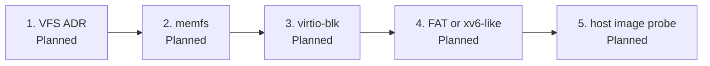

# Filesystem: new vs extend

**Today there is no filesystem.** No virtual file layer (VFS), no block driver, no on-disk format, no `open`/`read` of a named file. Nothing is compatible with Linux, Windows, or a USB stick **out of the box**.

This page is **Planned** direction, not a probe that a guest can open a file. Do not say “supports FAT,” “has ext,” or “ctos has files.” Hub: [honesty ledger](../framework/honesty-ledger.md), [What can run today](what-can-run.md).

A `grep` of `src/` for memfs / virtio-blk / FAT / inode code staying empty is the probe for “none now.”

## New vs extend

**Prefer implementing a known small filesystem** behind a **thin VFS** (that VFS needs its own ADR when it lands) over inventing a novel on-disk format.

| Fit | What | Why |
| --- | --- | --- |
| Best first | **Ramdisk / memfs** | Named buffers on the existing heap. Prove create / lookup / read / write **without** DMA or a disk image. Same “extend the kernel in-tree” shape as a coop task. |
| Best next on-disk | **virtio-blk** + **FAT16/32** or a **tiny xv6-like inode FS** | FAT if we want a host-visible image; xv6-like if we want a teaching inode layout. Pick in the ADR that lands it — this page does not ship a format. |
| Later, optional | ctos-specific **virtual mounts** (memfs + one on-disk FS under one VFS) | Only after memfs and a block FS have probes. Not a new magic format. |

## Avoid early

Do **not** start with **ext4**, **btrfs**, **ZFS**, or **NTFS**. Those are large, journaled or feature-heavy, and hide the VFS/block miles. They are not a first cut.

Host QEMU `-drive` without guest code is not a filesystem.

## Roadmap order (Planned)

One milestone → one branch → one PR. Do not stack a later step on an open earlier one.

*Every box is Planned. File presence of this page is not a filesystem. Do not say “supports FAT.”*

1. **VFS ADR** — thin interface (lookup / read / write / a path). IDs unchanged until an issue + ADR says otherwise.
2. **memfs Verified** — in-RAM named buffers; serial / `#[test_case]` that do not exist yet.
3. **virtio-blk** — virtqueues + sector I/O on QEMU `virt`.
4. **On-disk FS** — FAT16/32 **or** tiny xv6-like, as that ADR decides.
5. **Host-checkable image probe** — a disk image the host can inspect (for FAT) or a guest round-trip the smoke script greps. Invent `fs: ok` / `blk: ok` **with** that PR, fail-closed.

Until those probes exist, status stays **Planned**.

## Honesty

| Claim | Probe | Status |
| --- | --- | --- |
| No FS/VFS/block stack in tree | Source absence in `src/` | Verified (absence) |
| memfs create/lookup/read/write | Serial + `#[test_case]` | **Planned** |
| virtio-blk | QEMU disk + guest driver + marker | **Planned** |
| FAT or xv6-like | Format + read-back / host image check | **Planned** |

Do not claim compatibility with anyone’s existing disk.
