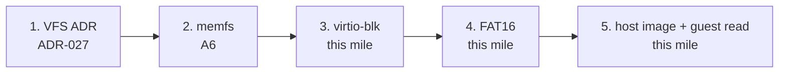

# Filesystem: new vs extend

**Today: thin VFS with two backends.** In-RAM **memfs** (A6 / [ADR-027](../03-adr/ADR-027-thin-vfs-memfs.md)) and **FAT16 on virtio-blk** (A7 / [ADR-028](../03-adr/ADR-028-virtio-blk-fat16.md)). Same `open` / `read` / `write` / `close`. FAT is **read-only**. Not POSIX `open`, not Linux VFS, not FAT32, not xv6.

Do not say “supports FAT” as a product. Say the guest read a known FAT16 file when the ledger has `fat: ok`. Hub: [honesty ledger](../framework/honesty-ledger.md), [What can run today](what-can-run.md). Extra stance: [filesystem.md](../framework/filesystem.md).

## New vs extend

**Prefer implementing a known small filesystem** behind this thin VFS over inventing a novel on-disk format.

| Fit | What | Why |
| --- | --- | --- |
| Landed | **Ramdisk / memfs** | Named heap buffers. Create / lookup / read / write without DMA. |
| This mile | **virtio-blk** + **FAT16** | Host-visible raw image (`scripts/mkfat16.py`). xv6-like was rejected so the host can inspect the volume. |
| Later, optional | ctos-specific **virtual mounts** | Prefix / tree mounts. Not a new magic format. A8 is sample **recipes**, not this. |

## Avoid early

Do **not** start with **ext4**, **btrfs**, **ZFS**, or **NTFS**. Those are large, journaled or feature-heavy, and hide the block mile. They are not a first cut.

Host QEMU `-drive` without guest virtio + a VFS read is not a filesystem.

## Roadmap order

One milestone → one branch → one PR.

*A7 is virtio-blk + FAT16. A8 is documented recipes. A9 uses the same volume for `/hello`. Do not say “supports FAT” as a product.*

1. **VFS ADR** — thin interface (create / open / read / write / close of a path).
2. **memfs** — in-RAM named buffers; serial `fs: ok`.
3. **virtio-blk** — virtqueues + sector I/O on QEMU `virt`. Serial `blk: ok`.
4. **On-disk FS** — FAT16 ([ADR-028](../03-adr/ADR-028-virtio-blk-fat16.md)). Serial `fat: ok`.
5. **Host-checkable image** — `scripts/mkfat16.py` writes `target/fat16.img`; smoke attaches `-drive if=none,file=…,id=hd0 -device virtio-blk-device,drive=hd0`. Guest `vfs::open("/probe")` must read `fat-hi`. A9 adds `--app` so `/hello` is the published app ELF.

## Honesty

| Claim | Probe | Status |
| --- | --- | --- |
| Thin VFS + memfs create/write/read/close | Serial `fs: ok` + `#[test_case]` | **Verified** (A6; honesty ledger) |
| virtio-blk sector R/W | Serial `blk: ok` + `#[test_case]` | **Verified** on this tip when the ledger has the probe |
| FAT16 `/probe` via the same `open` | Serial `fat: ok` + `#[test_case]` | **Verified** on this tip when the ledger has the probe |
| FAT16 `/hello` app slot (A9) | Serial `slot: ok` + `#[test_case]` | **First cut** when the ledger has the probe |

Do not claim compatibility with anyone’s existing disk.
