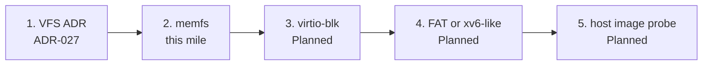

# Filesystem: new vs extend

**Today: in-RAM memfs behind a thin VFS.** Named buffers on the first-fit heap. Create / open / read / write / close of a flat path (`/name`). That mile is [ADR-027](../03-adr/ADR-027-thin-vfs-memfs.md) / Track A A6. It is **not** a disk, **not** FAT, **not** POSIX `open`, and **not** Linux VFS.

Do not say “supports FAT,” “has ext,” or “ctos has files” as if a host-visible volume existed. Hub: [honesty ledger](../framework/honesty-ledger.md), [What can run today](what-can-run.md). Extra stance: [filesystem.md](../framework/filesystem.md).

## New vs extend

**Prefer implementing a known small filesystem** behind this thin VFS over inventing a novel on-disk format.

| Fit | What | Why |
| --- | --- | --- |
| This mile | **Ramdisk / memfs** | Named buffers on the existing heap. Create / lookup / read / write **without** DMA or a disk image. |
| Best next on-disk | **virtio-blk** + **FAT16/32** or a **tiny xv6-like inode FS** | FAT if we want a host-visible image; xv6-like if we want a teaching inode layout. Pick in the A7 ADR — this page does not ship a format. |
| Later, optional | ctos-specific **virtual mounts** (memfs + one on-disk FS under one VFS) | Only after a block FS has probes. Not a new magic format. |

## Avoid early

Do **not** start with **ext4**, **btrfs**, **ZFS**, or **NTFS**. Those are large, journaled or feature-heavy, and hide the block mile. They are not a first cut.

Host QEMU `-drive` without guest code is not a filesystem.

## Roadmap order

One milestone → one branch → one PR. Do not stack a later step on an open earlier one.

*VFS + memfs are this PR. Do not say “supports FAT.”*

1. **VFS ADR** — thin interface (create / open / read / write / close of a path). IDs unchanged.
2. **memfs** — in-RAM named buffers; serial `fs: create` / `fs: write` / `fs: read` / `fs: el0` / `fs: ok` plus `#[test_case]`.
3. **virtio-blk** — virtqueues + sector I/O on QEMU `virt`. **Planned** (A7).
4. **On-disk FS** — FAT16/32 **or** tiny xv6-like, as that ADR decides. **Planned** (A7).
5. **Host-checkable image probe** — a disk image the host can inspect (for FAT) or a guest round-trip the smoke script greps. Invent `blk: ok` **with** that PR, fail-closed.

Until those later probes exist, on-disk status stays **Planned**.

## Honesty

| Claim | Probe | Status |
| --- | --- | --- |
| Thin VFS + memfs create/write/read/close | Serial `fs: ok` + `#[test_case]` | **Verified** on this tip (honesty ledger) |
| virtio-blk | QEMU disk + guest driver + marker | **Planned** |
| FAT or xv6-like | Format + read-back / host image check | **Planned** |

Do not claim compatibility with anyone’s existing disk.
