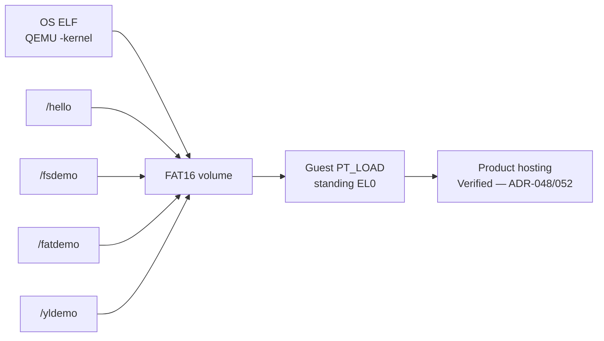
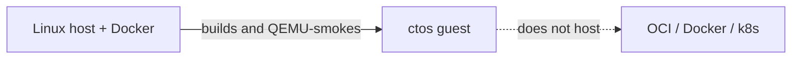

# Hosting applications — gaps, and containers

What ctos can **host** today under the scoped Track A product claim (a loaded freestanding user-mode binary with a stable ABI on an OS/app slot), what is still missing for stronger isolation, and whether it can host **containers**.

Today you also **extend the kernel** ([Building or porting](porting.md)). Samples that exist: [What can run today](what-can-run.md). Isolation notes: [el0.md](../framework/el0.md). Kernel SVC numbers: [syscall.md](../framework/syscall.md).

Do not say ctos hosts Linux programs, POSIX apps, or containers. The scoped freestanding slot-hosting claim is **Verified** under [ADR-048](../03-adr/ADR-048-app-hosting-claim-criteria.md) / [ADR-052](../03-adr/ADR-052-sponsor-accept-app-hosting.md).

## Today vs the slot split (A9 + product claim)

**Today (Verified miles + product claim):** QEMU `-kernel` still loads one **OS** ELF. Published freestanding samples live on FAT `/hello` (A9), `/fsdemo` ([ADR-059](../03-adr/ADR-059-fs-libctos-sample.md)), `/fatdemo` ([ADR-061](../03-adr/ADR-061-fat-libctos-sample.md)), and `/yldemo` ([ADR-062](../03-adr/ADR-062-yield-libctos-sample.md)). A2–A4 load `/hello` (no production embed). The same hello ELF boots on this OS and on `ba6541c` ([ADR-032](../03-adr/ADR-032-track-a-leftovers.md)). Under [ADR-048](../03-adr/ADR-048-app-hosting-claim-criteria.md) criteria Met×5 ([ADR-052](../03-adr/ADR-052-sponsor-accept-app-hosting.md)), the product sentence “apps run independently of the OS” / “app hosting is done” is **Verified** for that freestanding slot path. It is **not** containers, **not** OTA, and **not** Linux/POSIX.

**Product claim (Verified):** “apps run independently / hosting done” is **Verified** under ADR-048 (checklist below). Scope stays freestanding slots — not Linux userspace.

*Freestanding slot-hosting is Verified (Met×5). Catalog samples deepen recipes; they do not reopen the claim. Do not say Linux hosting, containers, OTA, or “EL0 isolated.” Runtime cost vs embed is a lab measurement pair ([ADR-046](../03-adr/ADR-046-slot-perf-delta.md)), not a marketing delta.*

## Gaps before hosting applications

These are missing pieces for richer hosting / isolation, not a schedule. Rows without a probe stay **Planned** or unbuilt. “Later” is not a promise.

A **supervisor call (SVC)** is how user-mode code asks the kernel for help. Reserved `SVC #0`–`#2` stay test miles. A1 documented `exit` / `uart_write` / `yield` ([syscall.md](../framework/syscall.md)). That is not a CRT or loader.

| Gap | Why it matters | Status |
| --- | --- | --- |
| **Stable SVC ABI** | A1 documented `exit` / `uart_write` / `yield` ([ADR-021](../03-adr/ADR-021-svc-syscall-abi.md)). That is a **kernel** contract, not a loader. | **ABI mile** — Verified only when the ledger has `svc: ok` on this tip. Mile ≠ whole product claim. |
| **libctos / CRT** | A2: `libctos` wrappers + `_start` CRT. Hello is host-built and published for the slot path ([ADR-022](../03-adr/ADR-022-libctos-crt.md)). | **CRT mile** — Verified only when the ledger has `libctos: ok` on this tip. Not a guest loader. |
| **ELF / user loader** | A3: guest ELF64 `PT_LOAD` into user TTBR0, then `ERET` to `e_entry` ([ADR-023](../03-adr/ADR-023-elf-pt-load-loader.md)). A2–A4 load FAT `/hello` (no production embed, [ADR-032](../03-adr/ADR-032-track-a-leftovers.md)). Not a Linux ELF ABI. | **Loader mile** — Verified only when the ledger has `loader: ok` on this tip. Not a Linux ABI. |
| **OS vs app slots** | A9: host kernel ELF + `hello-libctos.elf`; guest FAT `/hello` ([ADR-030](../03-adr/ADR-030-os-app-slots.md)). Same ELF on this OS and `ba6541c` ([ADR-032](../03-adr/ADR-032-track-a-leftovers.md)). | **Slot first cut + leftover** — Verified only when the ledger has `slot: ok` and the cross-update host lines on this tip. Product claim uses this mile under ADR-048. |
| **Standing user mode as normal** | A4: loaded image stands until `exit`; fail-closed restore ([ADR-024](../03-adr/ADR-024-standing-el0-normal.md)). Not a process table. | **Standing-task mile** — Verified only when the ledger has `el0: task-ok` on this tip. Not isolation. |
| **Stronger isolation** | Umbrella stays Planned/non-claim until checklist ([ADR-055](../03-adr/ADR-055-el0-isolated-checklist.md) / [ADR-047](../03-adr/ADR-047-isolation-leftovers-decisions.md); sponsor closure [ADR-060](../03-adr/ADR-060-isolation-leftovers-closure-checklist.md); PAN enable locked [ADR-054](../03-adr/ADR-054-pan-enable-lock.md); `_start` stays; taken SError hard-stopped [ADR-053](../03-adr/ADR-053-taken-serror-hard-stop.md)) | **Planned / non-claim until checklist** — do not say “EL0 isolated” |
| **VFS + memfs** | Thin VFS + in-RAM named buffers ([ADR-027](../03-adr/ADR-027-thin-vfs-memfs.md)); see [Filesystem](filesystem.md) | **memfs mile** — Verified only when the ledger has `fs: ok` on this tip. Not POSIX. Not FAT. |
| **On-disk FS** | virtio-blk + FAT16 behind the same VFS ([ADR-028](../03-adr/ADR-028-virtio-blk-fat16.md)); write depth ([ADR-050](../03-adr/ADR-050-fat16-write.md)) | **block + FAT mile** — Verified only when the ledger has `blk: ok` / `fat: ok` (and `fat: write` / `fat: create` for write). Not POSIX. Not “supports FAT” as a product. |
| **Richer I/O** | UART byte in/out only; no TTY, disk beyond FAT, or sockets | UART probed; the rest unbuilt |
| **Preemption / extra CPUs / net** | Cooperative one-CPU yield; no NIC | Later — not required for the ADR-048 claim |

“Host an application independently of the OS” / “app hosting is done” is **Verified** under [ADR-048](../03-adr/ADR-048-app-hosting-claim-criteria.md) (documented recipes + slot cross-update + no production embed + honesty about missing Linux/POSIX/containers + sponsor accept / [ADR-052](../03-adr/ADR-052-sponsor-accept-app-hosting.md)). That block is **Track A**. A1–A9 first cuts alone were never enough; the checklist Met×5 is. A5: PAN ID-field Verified; enable is non-goal on default cortex-a57 ([ADR-047](../03-adr/ADR-047-isolation-leftovers-decisions.md)). A8 documented rebuild recipes ([what-can-run.md](what-can-run.md)). A9 + leftover: FAT `/hello`, no production embed, cross-update on `ba6541c`. See [Immutability](advantages.md#immutability).

## Containers

**Non-goal.** ctos cannot host OCI / Docker / Kubernetes workloads, and it is **not aiming to**.

Those need Linux kernel features (namespaces, cgroups, a Linux ABI, usually overlay or equivalent, a rich syscall surface) that this learning kernel **does not have**. Decision: [ADR-029](../03-adr/ADR-029-containers-nongoal.md). Track B B7 ([#47](https://github.com/artofdream/ctos/issues/47)).

**Today the arrow is the other way:** Docker on a host (cts-ai `linux/arm64`) **runs the ctos smoke image**. That is “Docker hosts ctos,” not “ctos hosts containers.” See the [README Docker notes](https://github.com/artofdream/ctos#readme) and the Docker rows in the [ledger](../framework/honesty-ledger.md).

*Host harness ≠ guest runtime. File presence of this page is not a container probe.*

Container support is **not Planned** on this page. Do not add a Planned row. Reopen only with a new GitHub epic plus a new ADR — not a Track B win, and not a new FR/NFR ID.

## Claim criteria (ADR-048)

Product “apps run independently / hosting done” is **Verified** when all of the following are ledger-Verified and sponsor-accepted ([ADR-048](../03-adr/ADR-048-app-hosting-claim-criteria.md) / [ADR-052](../03-adr/ADR-052-sponsor-accept-app-hosting.md)):

1. Documented freestanding-app recipes (existing markers only).
2. Slot cross-update (same published ELF on this OS and a documented prior OS).
3. No production hello embed (`slot: embed` never appears on the production path).
4. Docs still refuse Linux ABI / POSIX / guest containers ([ADR-029](../03-adr/ADR-029-containers-nongoal.md)).
5. Explicit sponsor accept on the flip PR (no self-merge).

### Progress vs tip `main` (honesty checklist)

Tip audited: `190ef5a` (Merge #106 / docs polish; or newer `main` with ADR-062). **Product row Verified** — criteria 1–5 **Met**. Catalog samples `/fsdemo` / `/fatdemo` / `/yldemo` deepen recipes; they do not reopen ADR-048/052.

| # | Criterion | Status | Tip evidence (cite ledger / tip) |
| --- | --- | --- | --- |
| 1 | Documented recipes (A8) | **Met** | Ledger “Documented sample apps (Track A A8)” Verified; hub [what-can-run.md](what-can-run.md) / [apps-today.md](../framework/apps-today.md) / `user/README.md`. |
| 2 | Slot cross-update | **Met** | Ledger “A9 cross-update …” Verified: `cross-update prior-os=ba6541c… slot:ok` + `cross-update this-os=… slot:ok` ([ADR-032](../03-adr/ADR-032-track-a-leftovers.md)). Re-probed on later tips (incl. ADR-046 / evo-x2 Docker rows). |
| 3 | No production embed | **Met** | Ledger “A2–A4 hello without `include_bytes!` (ADR-032)” Verified; smoke rejects `slot: embed`. Probe-only `include_bytes!` in `src/slot.rs` only ([ADR-046](../03-adr/ADR-046-slot-perf-delta.md)). |
| 4 | Honesty: no Linux/POSIX/containers | **Met** | Containers **non-goal** ([ADR-029](../03-adr/ADR-029-containers-nongoal.md)); this page + Track B frame refuse Linux userspace / POSIX / guest OCI. |
| 5 | Explicit sponsor accept | **Met** | Sponsor: “address 1. app hosting” after still-Planned #5-only review. [ADR-052](../03-adr/ADR-052-sponsor-accept-app-hosting.md). Flip PR; no self-merge. |

A1–A9 first cuts alone remain insufficient without the checklist. Matching ledger section: [honesty-ledger.md — ADR-048 progress](../framework/honesty-ledger.md#adr-048-progress-checklist).

## Honesty

| Claim | Status |
| --- | --- |
| ctos hosts freestanding slot apps / “hosting done” (ADR-048 scope) | **Yes — Verified** ([ADR-048](../03-adr/ADR-048-app-hosting-claim-criteria.md) / [ADR-052](../03-adr/ADR-052-sponsor-accept-app-hosting.md)) |
| ctos hosts Linux programs / POSIX / glibc/musl | **No** |
| ctos hosts OCI/Docker containers | **No** — **non-goal** ([ADR-029](../03-adr/ADR-029-containers-nongoal.md)) |
| Linux-compat research (Track B) | Frame ([ADR-031](../03-adr/ADR-031-linux-compat-goals.md)) + B2 gap map ([linux-aarch64-syscall-gap.md](../research/linux-aarch64-syscall-gap.md)) + B3 process-model stance ([ADR-035](../03-adr/ADR-035-process-model-standing-el0.md)) + B4 ELF/auxv gap ([ADR-033](../03-adr/ADR-033-linux-elf-auxv-pt-interp.md)) + B5 VFS compare ([ADR-034](../03-adr/ADR-034-linux-vfs-vs-thin-ctos.md)). **Not claiming Linux userspace yet.** **Not claiming dynamic Linux ELF.** **Not claiming a Linux filesystem.** |
| Host Docker runs `ctos-smoke` | Separate ledger row (host tool, not a guest runtime) |
