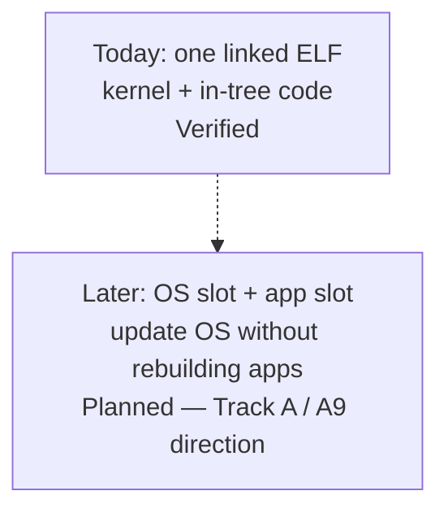

# Hosting applications — gaps, and containers

What is missing before ctos could **host** an application (a loaded user-mode binary with a stable ABI), and whether it can host **containers**.

Today you **extend the kernel** ([Building or porting](porting.md)). Samples that exist: [What can run today](what-can-run.md). Isolation notes: [el0.md](../framework/el0.md). Kernel SVC numbers: [syscall.md](../framework/syscall.md).

Do not say ctos is an app host or a container runtime.

## Today vs the slot split (A9 direction)

**Today:** one linked ELF. Kernel code and any “app-shaped” experiment ship together. QEMU `-kernel` loads that one image.

**Later (Planned):** an **OS slot** (the kernel you update) and an **app slot** (a loaded user-mode binary that can survive an OS swap). That split is the useful meaning of immutability. It depends on Track A (loader + stable ABI + CRT). It is **not** containers and **not** over-the-air firmware updates.

*Do not say the slot split exists. Runtime cost vs “same as today” is unmeasured.*

## Gaps before hosting applications

These are missing pieces, not a schedule. Rows without a probe stay **Planned** or unbuilt. “Later” is not a promise.

A **supervisor call (SVC)** is how user-mode code asks the kernel for help. Reserved `SVC #0`–`#2` stay test miles. A1 documented `exit` / `uart_write` / `yield` ([syscall.md](../framework/syscall.md)). That is not a CRT or loader.

| Gap | Why it blocks hosting | Status |
| --- | --- | --- |
| **Stable SVC ABI** | A1 documented `exit` / `uart_write` / `yield` ([ADR-021](../03-adr/ADR-021-svc-syscall-abi.md)). That is a **kernel** contract, not a loader. | **ABI mile** — Verified only when the ledger has `svc: ok` on this tip. Not app hosting. |
| **libctos / CRT** | A2: `libctos` wrappers + `_start` CRT. Hello is host-built and copied onto the standing EL0 page ([ADR-022](../03-adr/ADR-022-libctos-crt.md)). | **CRT mile** — Verified only when the ledger has `libctos: ok` on this tip. Not a guest loader. |
| **ELF / user loader** | A3: guest ELF64 `PT_LOAD` into user TTBR0, then `ERET` to `e_entry` ([ADR-023](../03-adr/ADR-023-elf-pt-load-loader.md)). Image is still embedded. Not a Linux ELF ABI. | **Loader mile** — Verified only when the ledger has `loader: ok` on this tip. Not app hosting. |
| **Standing user mode as normal** | A4: loaded image stands until `exit`; fail-closed restore ([ADR-024](../03-adr/ADR-024-standing-el0-normal.md)). Not a process table. | **Standing-task mile** — Verified only when the ledger has `el0: task-ok` on this tip. Not isolation. Not app hosting. |
| **Stronger isolation** | Umbrella user-mode isolation needs PAN + fuller identity teardown | **Planned** — do not say “EL0 isolated” |
| **VFS + memfs** | No files, no paths; see [Filesystem](filesystem.md) | **Planned** |
| **Richer I/O** | UART byte in/out only; no TTY, disk, or sockets | UART probed; the rest unbuilt |
| **Preemption / extra CPUs / net** | Cooperative one-CPU yield; no NIC | Later — not a near hosting gate |

Until VFS + slots have probes, “host an application” is a sentence we do not use. That block is **Track A**. A1 landed the kernel SVC ABI. A2 landed `libctos`. A3 landed a guest `PT_LOAD` loader (embedded image, not a filesystem `exec`). A4 landed standing EL0 as the supported path for that loaded image. A5 landed the identity `.rodata` tear and a PAN ID-field probe (enable Planned). A6–A9 stay **Planned**. See [Immutability](advantages.md#immutability).

## Containers

**No.** ctos cannot host OCI / Docker / Kubernetes workloads.

Those need Linux kernel features (namespaces, cgroups, a Linux ABI, usually overlay or equivalent, a rich syscall surface) that this learning kernel **does not have** and is **not aiming at soon**.

**Today the arrow is the other way:** Docker on a host (cts-ai `linux/arm64`) **runs the ctos smoke image**. That is “Docker hosts ctos,” not “ctos hosts containers.” See the [README Docker notes](https://github.com/artofdream/ctos#readme) and the Docker rows in the [ledger](../framework/honesty-ledger.md).

Container support is **not Planned** on this page. Do not add a Planned row unless the sponsor asks for that direction in an ADR.

## Honesty

| Claim | Status |
| --- | --- |
| ctos hosts third-party apps | **No** — gaps above |
| ctos hosts OCI/Docker containers | **No** — not a goal on this page |
| Host Docker runs `ctos-smoke` | Separate ledger row (host tool, not a guest runtime) |
