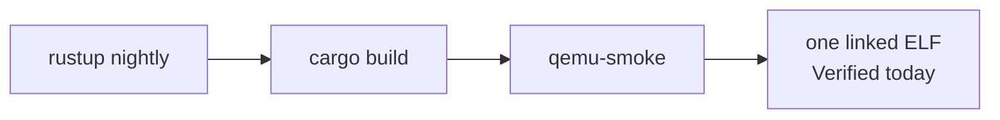

# Building or porting something to ctos

Plain English. There is **no easy POSIX port** today. ctos is a kernel you **extend in-tree**, not a host you drop apps onto.

What already runs (rebuild recipes): [What can run today](what-can-run.md). In-tree index: [`user/README.md`](https://github.com/artofdream/ctos/blob/main/user/README.md). How to build the kernel: [prerequisites](prerequisites.md). Probes: [honesty ledger](../framework/honesty-ledger.md).

Do not claim an “easy port” path that does not exist.

## Today (honest)

Nothing POSIX ports easily.

There is **no C library (libc)**, **no dynamic linker**, and **no POSIX filesystem**. Thin VFS + memfs + read-only FAT16 are not Linux `open`. A1 documented a **kernel** SVC ABI (`exit` / `uart_write` / `yield` — [syscall.md](../framework/syscall.md), [ADR-021](../03-adr/ADR-021-svc-syscall-abi.md)). A2 adds a freestanding **`libctos` CRT** you can link in-tree ([ADR-022](../03-adr/ADR-022-libctos-crt.md)). A3 parses that in-tree ELF on the guest and maps `PT_LOAD` ([ADR-023](../03-adr/ADR-023-elf-pt-load-loader.md)). That is not an application porting target for Linux binaries. There is no `PT_INTERP` / glibc path that would run a foreign user-mode binary if you built one elsewhere.

A Linux, musl, or glibc program is a different contract. Recompiling it “for AArch64” does not make it a ctos program.

## Easiest today

Write **in-tree `no_std` Rust** and ship it as part of the kernel image.

Typical shape (A8 recipes — [what-can-run.md](what-can-run.md)):

- A cooperative **kernel task** (same class as `sched: task a/b`) or a small kernel module
- Use UART / `println!` for output; `yield` to other tasks
- Optional: serial receive for a byte-in gadget
- Optional: link `libctos` like `user/hello-libctos` (still embedded; not a second `-kernel`)

Rebuild the whole guest with the existing target:

```bash
cargo build                 # aarch64-ctos.json
./scripts/qemu-smoke.sh     # or ./scripts/docker-smoke.sh on linux/arm64
```

That is **rebuild the kernel**, not “port an app.” The new code lives in `src/` and links into `target/aarch64-ctos/debug/ctos`.



*One image, one `-kernel` load. An OS slot vs a separate app slot is Planned.*

## Not easy

- Recompile Linux / C / Rust apps against **glibc** or **musl**
- Drop in a userspace ELF (`ET_DYN` or a Linux `ET_EXEC`)
- Expect `std`, files, sockets, threads, or a process table

Those need a loader and a userspace that ctos does not have. The standing user-mode stub is a **test mile** plus an A1 ABI trip and an A2 `libctos` hello, not that runtime ([el0.md](../framework/el0.md), [syscall.md](../framework/syscall.md)).

## Track A miles that already have recipes

A1–A7 are probed. A8 is **docs**: the recipes on [what-can-run.md](what-can-run.md). Still not “applications port to ctos.” You extend the kernel or link `libctos` in-tree.

1. A **stable SVC ABI** — A1 (`exit` / `uart_write` / `yield`).
2. A freestanding CRT / `libctos` — A2.
3. Guest `PT_LOAD` of that in-tree ELF — A3. Image still embedded.
4. Standing EL0 as **normal** until `exit` — A4 / [ADR-024](../03-adr/ADR-024-standing-el0-normal.md).
5. Isolation cut (identity `.rodata` + PAN ID-field) — A5. PAN **enable** Planned.
6. Thin VFS + memfs — A6. Recipe 4.
7. virtio-blk + FAT16 — A7. Recipe 5.

Isolation and a real userspace stay **Planned**. Gaps before hosting, and why containers are a **non-goal**: [Hosting apps / containers](hosting-apps.md).

A POSIX filesystem is the same story: **not present**. Thin VFS + memfs + read-only FAT16 are not Linux `open`. Direction: [Filesystem: new vs extend](filesystem.md).

## Later (A9 — Planned)

An **OS image vs app payload** split ([A9 #48](https://github.com/artofdream/ctos/issues/48)): two artifacts + a load path + a cross-update probe. Today is still one linked ELF — not Verified. See [overview.md](../framework/overview.md) and [immutability.md](../framework/immutability.md).
