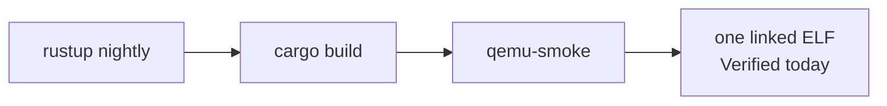

# Building or porting something to ctos

Plain English. There is **no easy POSIX port** today. ctos is a kernel you **extend in-tree**, not a host you drop apps onto.

What already runs: [What can run today](what-can-run.md). How to build the kernel: [prerequisites](prerequisites.md). Probes: [honesty ledger](../framework/honesty-ledger.md).

Do not claim an “easy port” path that does not exist.

## Today (honest)

Nothing POSIX ports easily.

There is **no C library (libc)**, **no dynamic linker**, **no filesystem**, and **no stable public application ABI**. There is no compiler target that produces a ctos userspace binary, and no loader that would run one if you built it elsewhere.

A Linux, musl, or glibc program is a different contract. Recompiling it “for AArch64” does not make it a ctos program.

## Easiest today

Write **in-tree `no_std` Rust** and ship it as part of the kernel image.

Typical shape:

- A cooperative **kernel task** (same class as `sched: task a/b`) or a small kernel module
- Use UART / `println!` for output; `yield` to other tasks
- Optional: serial receive for a byte-in gadget

Rebuild the whole guest with the existing target:

```bash
cargo build                 # aarch64-ctos.json
./scripts/qemu-smoke.sh     # or ./scripts/docker-smoke.sh on linux/arm64
```

That is **rebuild the kernel**, not “port an app.” The new code lives in `src/` and links into `target/aarch64-ctos/debug/ctos`.



*One image, one `-kernel` load. An OS slot vs a separate app slot is Planned.*

## Not easy

- Recompile Linux / C / Rust apps against **glibc** or **musl**
- Drop in a userspace ELF (`ET_DYN` or a Linux `ET_EXEC`)
- Expect `std`, files, sockets, threads, or a process table

Those need an ABI, a loader, and a userspace that ctos does not have. The standing user-mode stub is a **test mile**, not that runtime ([el0.md](../framework/el0.md)).

## Later (Planned)

A path that is **not built**. Call this **Track A** when talking about an OS slot vs app slot ([Immutability](advantages.md#immutability)):

1. A **stable SVC ABI** — documented syscall numbers, not today’s test `SVC #1` / `#2` (a supervisor call is how user-mode code asks the kernel for help)
2. A freestanding C runtime / `libctos` for user mode
3. Link a freestanding AArch64 user-mode binary
4. Map it into the **user page table** and return to user mode

Until those exist and have ledger probes, do not say applications “port to ctos.” You extend the kernel. Isolation and a real userspace stay **Planned**. Gaps before hosting, and why containers are **no**: [Hosting apps / containers](hosting-apps.md).

A filesystem is the same story: **Planned**, not present. Direction: [Filesystem: new vs extend](filesystem.md).
