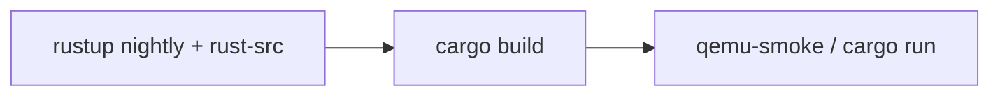

# Prerequisites

What you need to **build and run the kernel**. Publishing this docs site is optional. GitHub Pages is not required for kernel work.

## Kernel (required)

| Need | Why |
| --- | --- |
| Nightly Rust + `rust-src` + `llvm-tools-preview` | Freestanding `build-std` for the custom `aarch64-ctos.json` target. Pin is `rust-toolchain.toml`. |
| `qemu-system-aarch64` | Primary guest is QEMU `-machine virt` ([ADR-003](../03-adr/ADR-003-primary-isa-aarch64.md)). Debian/Ubuntu package is often `qemu-system-arm`. |
| A host that can run those tools | Windows, macOS, or Linux. The **kernel** target stays AArch64. |

```bash
rustup toolchain install nightly
rustup component add rust-src llvm-tools-preview
# Debian/Ubuntu: sudo apt-get install qemu-system-arm

cargo build          # ELF at target/aarch64-ctos/debug/ctos
cargo run            # qemu-system-aarch64 -machine virt
./scripts/qemu-smoke.sh
```



*That rebuilds **the kernel**, including any in-tree `no_std` code you add. It is not a port of a Linux app. See [Building or porting](porting.md).*

Commands and honesty notes: [GitHub README](https://github.com/artofdream/ctos#readme). A successful `cargo build` on your machine is not a copied Verified boot from another host.

## Optional

| Extra | When |
| --- | --- |
| Docker `linux/arm64` | cts-ai (Windows ARM64) path: `./scripts/docker-smoke.sh`. Do **not** pass `--platform linux/amd64`. |
| mdBook 0.5.4 + mdbook-mermaid 0.17.1 | Local docs site only: `./scripts/docs-build.sh`. See [Docs website + DNS](../website.md). |

## Not required

- GitHub Pages, a custom domain, or `ctos.artof.link` (the site is live; you still do not need it to hack the kernel)
- Raspberry Pi hardware, an x86_64 boot path, or VGA
- Obsidian (`.obsidian/` is gitignored)
- AWS / Route 53 credentials (DNS is a publish concern, not a kernel build concern)
