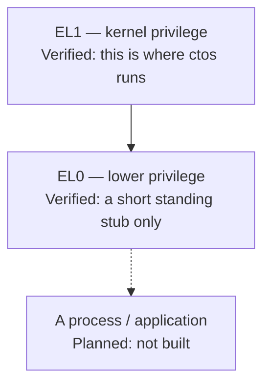
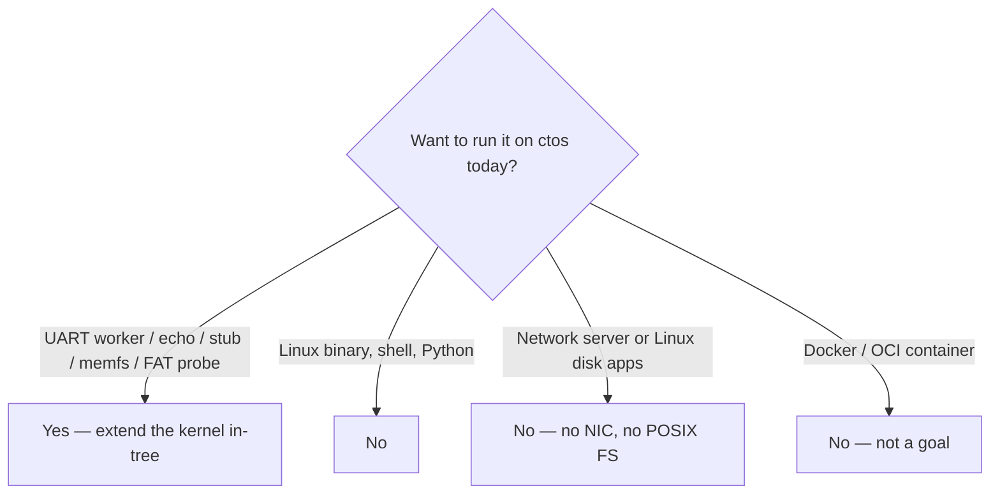

# What can run today

Plain English. These are **rebuild recipes** for in-tree samples that already have probes. They are not third-party applications and not a product runtime.

**Track A / A8** ([issue #39](https://github.com/artofdream/ctos/issues/39)) is this page: document the sample classes and how to rebuild them. A9 ([ADR-030](../03-adr/ADR-030-os-app-slots.md)) adds two host artifacts + FAT `/hello`. App hosting / cross-update stays **Planned**.

Status of each probe: [honesty ledger](../framework/honesty-ledger.md). Walkthroughs: [apps-today.md](../framework/apps-today.md). In-tree index: [`user/README.md`](https://github.com/artofdream/ctos/blob/main/user/README.md). Isolation of user programs stays **Planned**. Do not say “apps,” “userspace,” or “secure OS” as if a general-purpose OS existed.

## Privilege — where code runs

The CPU has privilege levels. **EL1** is kernel privilege (where ctos runs). **EL0** is lower privilege (user mode). A **process** would be a loaded program with its own address space, files, and a public ABI. That process does **not** exist yet.



*The stub is not a process. Umbrella “EL0 isolated” stays Planned.*

A **supervisor call (SVC)** is the instruction the stub uses to ask the kernel for something. Reserved `SVC #0`–`#2` stay test miles. A1 documented `exit` / `uart_write` / `yield` ([syscall.md](../framework/syscall.md)). A2 wraps those in `libctos`. That is not a process ABI.

## One rebuild for every recipe

Every sample below rides the **same hello path**. There is no separate “run this app” command. You rebuild the kernel (and, for the EL0 hello, `build.rs` publishes `target/hello-libctos.elf` and still embeds a copy for A2–A4).

```bash
cargo build                 # aarch64-ctos.json; also builds user/hello-libctos
./scripts/qemu-smoke.sh     # fail-closed serial greps + cargo test + force-fail
```

`qemu-smoke` attaches the A7 FAT16 image (`target/fat16.img`) and injects UART `0x41`. A machine that has not run that script (or Docker / GHA equivalent) stays **Unknown** for boot. File presence is not the probe.


*Rebuild the guest. Do not drop in a foreign ELF.*

## Recipe 1 — Cooperative UART workers (EL1)

Two tasks on **heap stacks** that print a line and **yield** to each other. Same class as `sched: task a` / `sched: task b` / `sched: ok` ([ADR-010](../03-adr/ADR-010-cooperative-rr-el1.md), [FR-11](../02-requirements/fr-nfr.md)).

| Piece | Path |
| --- | --- |
| Workers | `src/sched.rs` (`task_a` / `task_b` / `run_two_tasks`) |
| Probe | `scripts/qemu-smoke.sh` greps `sched: ok` and both task lines |

Rebuild: edit those functions, then the one-rebuild commands above. A heartbeat / counter variant (print, yield, loop) is the natural next in-tree exercise. It is **not** in the tree and has no `sched: beat` marker — **Planned** until a probe greps one.

Not preemptive. Not two CPUs. Not EL0.

## Recipe 2 — UART RX echo gadget

Read a byte from **PL011 RX** and print it. Same class as `input: rx 0x41` ([ADR-007](../03-adr/ADR-007-pl011-uart-rx.md), [FR-08](../02-requirements/fr-nfr.md)).

| Piece | Path |
| --- | --- |
| Guest poll | `src/uart.rs` (`observe_rx` / `observe_probe_byte`) |
| Host inject | `scripts/qemu-serial-inject.py` (default `CTOS_INPUT_BYTE=0x41`) |

Rebuild: same `cargo build` + `./scripts/qemu-smoke.sh`. The smoke host injects one byte. IRQs stay masked on this path. Do not `wfi` waiting for RX.

That is a byte in, a line out. **No TTY, no line editor, no canonical mode, no virtio-keyboard.**

## Recipe 3 — Standing EL0 / libctos-loaded hello

A short payload in **user mode (EL0)** that uses the documented ABI, then returns. Miles stacked on one embedded image:

| Mile | Serial (do not invent extras) | Decision |
| --- | --- | --- |
| Standing stub | `el0: standing` / `el0: restored` | [ADR-013](../03-adr/ADR-013-el0-isolation-direction.md) |
| SVC ABI | `svc: yield` / `svc: user-hi` / `svc: uart` / `svc: exit` / `svc: ok` | [ADR-021](../03-adr/ADR-021-svc-syscall-abi.md) |
| `libctos` hello | `libctos: hi` / `libctos: ok` / `libctos: linked` | [ADR-022](../03-adr/ADR-022-libctos-crt.md) |
| Guest `PT_LOAD` | `loader: mapped` / `loader: ok` | [ADR-023](../03-adr/ADR-023-elf-pt-load-loader.md) |
| Standing task | `el0: task-enter` / `el0: task-active` / `el0: task-exit` / `el0: task-ok` | [ADR-024](../03-adr/ADR-024-standing-el0-normal.md) |

| Piece | Path |
| --- | --- |
| Hello source | `user/hello-libctos/` ([recipe README](https://github.com/artofdream/ctos/blob/main/user/hello-libctos/README.md)) |
| CRT / wrappers | `libctos/` |
| Host embed | `build.rs` (`include_bytes!` of the ELF + flattened `.bin`) |
| Guest map | `src/loader.rs` |

Rebuild the hello (optional, standalone):

```bash
cargo build --release \
  --manifest-path user/hello-libctos/Cargo.toml \
  --target user/hello-libctos/aarch64-ctos-user.json
```

A kernel `cargo build` already does that via `build.rs` and embeds the result. Then `./scripts/qemu-smoke.sh`. There is no `exec` of a file on disk. The image is still one linked kernel ELF.

This is **not** a process. No libc, no argv, no loader for a foreign ELF. “EL0 isolated” stays **Planned**.

`libctos` already wraps `fs_open` / `fs_read` (SVC 20–21). The **hello payload does not call them**. The Verified EL0 VFS trip is a kernel trampoline (`/eprobe` → `fs: el0`), not this hello. Teaching a hello that opens `/probe` would be a new marker — do not claim it from this recipe.

## Recipe 4 — memfs named-buffer probe (optional)

In-RAM named buffers behind the thin VFS ([ADR-027](../03-adr/ADR-027-thin-vfs-memfs.md)). Same class as `fs: create` / `fs: write` / `fs: read` / `fs: el0` / `fs: ok`.

| Piece | Path |
| --- | --- |
| VFS + memfs | `src/vfs.rs` |
| EL0 trampoline | `src/syscall.rs` (`/eprobe` writes `memfs-el0`) |
| Wrappers | `libctos` `fs_create` / `fs_open` / `fs_read` / `fs_write` / `fs_close` |

Rebuild: same one-rebuild commands. Not POSIX. Not a volume. Not app hosting.

## Recipe 5 — FAT16 `/probe` on virtio-blk (optional)

Read-only FAT16 on QEMU virtio-mmio block ([ADR-028](../03-adr/ADR-028-virtio-blk-fat16.md)). Same VFS `open` as memfs. Same class as `blk: ok` / `fat: mount` / `fat: read` / `fat: ok`. Guest `/probe` must read `fat-hi`.

| Piece | Path |
| --- | --- |
| Host image | `scripts/mkfat16.py` → `target/fat16.img` |
| Guest virtio | `src/virtio.rs` |
| FAT + VFS | `src/fat.rs`, `src/vfs.rs` |

`qemu-smoke` builds the image and attaches:

`-drive if=none,file=target/fat16.img,format=raw,id=hd0 -device virtio-blk-device,drive=hd0`

Host `-drive` without the guest serial is **not** the probe. Not POSIX. Not FAT32. Not writeable FAT. Do not say “supports FAT” as a product.

## Recipe 6 — OS image vs app slot (A9 first cut)

Two host artifacts and a FAT load path ([ADR-030](../03-adr/ADR-030-os-app-slots.md)). Same class as `slot: fat` / `slot: mapped` / `slot: ok` / `perf: app-load`.

| Piece | Path |
| --- | --- |
| OS image | `target/aarch64-ctos/debug/ctos` (QEMU `-kernel`) |
| App payload | `target/hello-libctos.elf` (published by `build.rs`) |
| FAT slot | `scripts/mkfat16.py --app` → `/hello` |
| Guest load | `src/slot.rs` + A3 `src/loader.rs` |

A2–A4 still embed a copy so their markers stay. Cross-update (same ELF on two OS builds) is **not** this recipe. Not OTA. Not “app hosting is done.”

## What cannot run



*“Yes” means rebuild the kernel. It does not mean drop in an app.*

Do not imply these work:

- Linux binaries (no Linux ABI, no ELF loader for third-party programs)
- A shell
- Python (or any hosted language runtime)
- Network servers (no NIC, no sockets, no DMA)
- POSIX / Linux filesystem apps (memfs + one FAT16 file is not that — [Filesystem](filesystem.md))
- Extra-CPU workloads (one CPU, cooperative yield only)
- Cross-update of one app ELF across two OS builds (**A9 remaining** — [issue #48](https://github.com/artofdream/ctos/issues/48); first cut is FAT `/hello`)

Also not claimed: POSIX, GPU, Raspberry Pi, certified security, “production ready,” or **containers** (**non-goal**, [ADR-029](../03-adr/ADR-029-containers-nongoal.md); [Hosting apps / containers](hosting-apps.md)).

How you would add something in-tree (and why Linux apps do not port): [Building or porting](porting.md).
