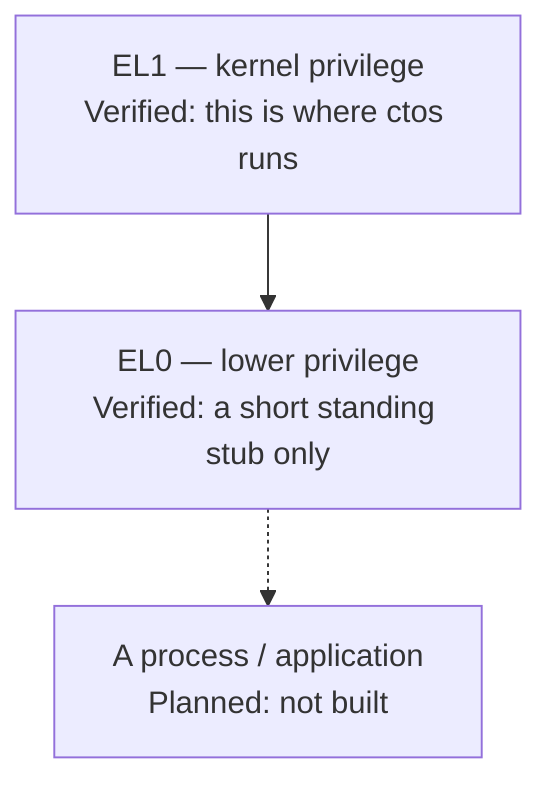
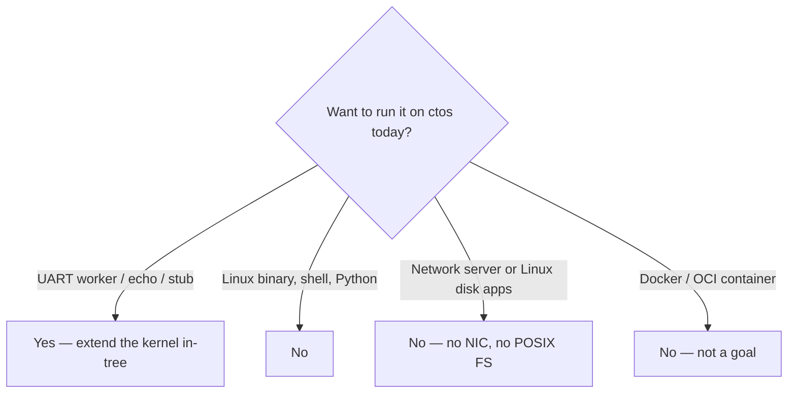

# What can run today

Plain English. These are **in-kernel samples** (or one short user-mode stub) that already have probes on this tree. They are not third-party applications and not a product runtime.

Status of each probe: [honesty ledger](../framework/honesty-ledger.md). How we measure: [measure.md](measure.md). Isolation of user programs stays **Planned**. Do not say “apps,” “userspace,” or “secure OS” as if a general-purpose OS existed.

## Privilege — where code runs

The CPU has privilege levels. **EL1** is kernel privilege (where ctos runs). **EL0** is lower privilege (user mode). A **process** would be a loaded program with its own address space, files, and a public ABI. That process does **not** exist yet.

*The stub is not a process. Umbrella “EL0 isolated” stays Planned.*

A **supervisor call (SVC)** is the instruction the stub uses to ask the kernel for something. Reserved `SVC #0`–`#2` stay test miles. A1 documented `exit` / `uart_write` / `yield` ([syscall.md](../framework/syscall.md)). A2 wraps those in `libctos`. That is not a process ABI.

## 1. Cooperative UART workers

Two tasks on **heap stacks** that print a line and **yield** to each other. Same class as the smoke markers `sched: task a` / `sched: task b` / `sched: ok` ([ADR-010](../03-adr/ADR-010-cooperative-rr-el1.md), cooperative scheduling — [FR-11](../02-requirements/fr-nfr.md)).

A natural variant is a **serial heartbeat or counter**: print a tick, yield, repeat. Still cooperative EL1. Still UART text. Not preemptive. Not two CPUs.

## 2. UART RX echo gadget

Read a byte from the serial receive path (**PL011 RX**) and print it. Same class as `input: rx 0x41` ([ADR-007](../03-adr/ADR-007-pl011-uart-rx.md)).

That is a byte in, a line out. **No TTY, no line editor, no canonical mode, no virtio-keyboard.**

## 3. Standing EL0 stub

A short payload in **user mode (EL0)** that does an SVC round-trip and returns. Same class as `el0: standing` / `el0: restored` ([ADR-013](../03-adr/ADR-013-el0-isolation-direction.md), [el0.md](../framework/el0.md)). After A1 the standing stub also runs the documented ABI trip (`svc: yield` / `svc: user-hi` / `svc: uart` / `svc: exit` / `svc: ok`). After A2 a **linked `libctos` hello** prints `libctos: hi` / `libctos: ok` then parks. After A3 the same ELF is also **parsed on the guest** and mapped via `PT_LOAD` (`loader: mapped` / `loader: ok`). After A4 that loaded image is a standing **task** until `exit` (`el0: task-ok`) ([syscall.md](../framework/syscall.md), [ADR-021](../03-adr/ADR-021-svc-syscall-abi.md), [ADR-022](../03-adr/ADR-022-libctos-crt.md), [ADR-023](../03-adr/ADR-023-elf-pt-load-loader.md), [ADR-024](../03-adr/ADR-024-standing-el0-normal.md)).

This is **not** a process. There is no libc, no argv, no loader for a foreign ELF. In-RAM memfs (A6) plus a read-only FAT16 file on virtio-blk (A7) are VFS backends, not a Linux volume. “EL0 isolated” stays **Planned**. The ABI + CRT + loader + standing-task + memfs + FAT miles are not app hosting.

## What cannot run

*“Yes” means rebuild the kernel. It does not mean drop in an app.*

Do not imply these work:

- Linux binaries (no Linux ABI, no ELF loader for third-party programs)
- A shell
- Python (or any hosted language runtime)
- Network servers (no NIC, no sockets, no DMA)
- POSIX / Linux filesystem apps (memfs + one FAT16 file is not that — [Filesystem](filesystem.md))
- Extra-CPU workloads (one CPU, cooperative yield only)

Also not claimed: POSIX, GPU, Raspberry Pi, certified security, “production ready,” or **containers** (**non-goal**, [ADR-029](../03-adr/ADR-029-containers-nongoal.md); [Hosting apps / containers](hosting-apps.md)).

How you would add something in-tree (and why Linux apps do not port): [Building or porting](porting.md).
