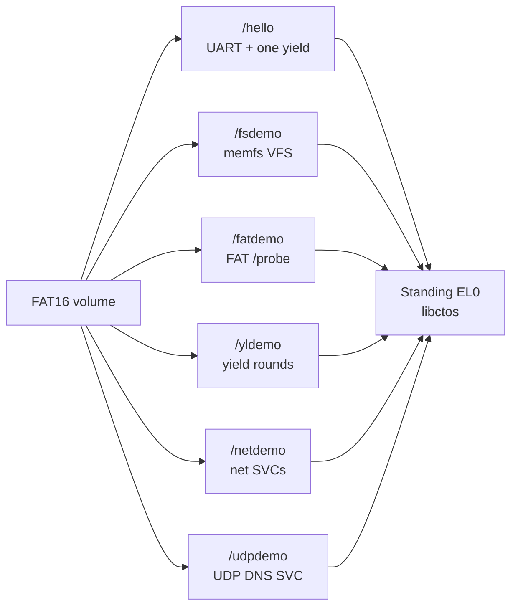
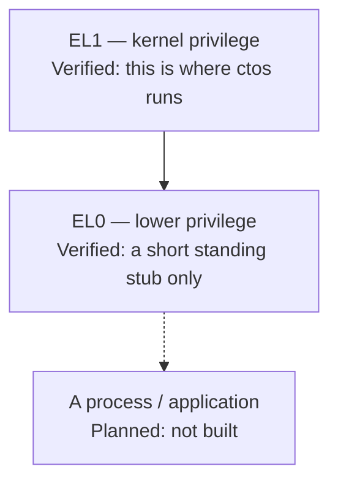
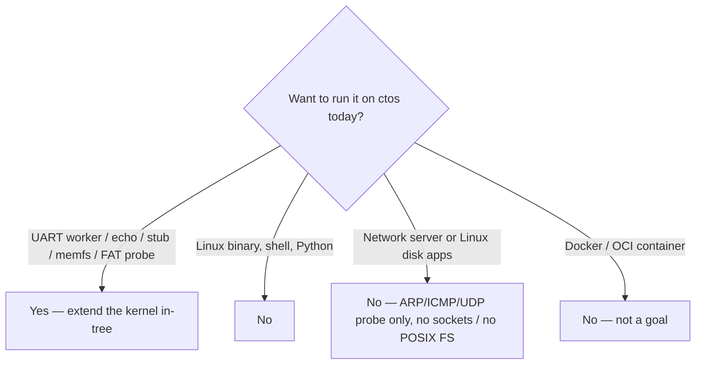

# What can run today

Plain English. These are **rebuild recipes** for in-tree samples that already have probes. They are not third-party applications and not a product runtime.

**Track A / A8** ([issue #39](https://github.com/artofdream/ctos/issues/39)) is this page: document the sample classes and how to rebuild them. A9 ([ADR-030](../03-adr/ADR-030-os-app-slots.md)) adds two host artifacts + FAT `/hello`. Leftover ([ADR-032](../03-adr/ADR-032-track-a-leftovers.md)): A2–A4 load that file (no production embed); same ELF on this OS and `ba6541c` (cross-update Verified). Product freestanding app hosting is **Verified** under [ADR-048](../03-adr/ADR-048-app-hosting-claim-criteria.md) / [ADR-052](../03-adr/ADR-052-sponsor-accept-app-hosting.md) (checklist: [hosting-apps.md](hosting-apps.md#claim-criteria-adr-048)). Not Linux/POSIX/containers.

Status of each probe: [honesty ledger](../framework/honesty-ledger.md). Walkthroughs: [apps-today.md](../framework/apps-today.md). In-tree index: [`user/README.md`](https://github.com/artofdream/ctos/blob/main/user/README.md). Umbrella “EL0 isolated” stays **Planned / non-claim** ([ADR-047](../03-adr/ADR-047-isolation-leftovers-decisions.md)). Do not say “apps,” “userspace,” or “secure OS” as if a general-purpose OS existed.

## Freestanding sample catalog (glance)

Six published EL0 ELFs on one FAT16 volume. Same rebuild path. Not Linux/POSIX.



*`/hello` is the A9 product-slot sample. `/fsdemo` (ADR-059), `/fatdemo` (ADR-061), `/yldemo` (ADR-062), `/netdemo` (ADR-068), and `/udpdemo` (ADR-071) deepen the catalog. Umbrella “EL0 isolated” stays Planned ([ADR-060](../03-adr/ADR-060-isolation-leftovers-closure-checklist.md)).*

## Privilege — where code runs

The CPU has privilege levels. **EL1** is kernel privilege (where ctos runs). **EL0** is lower privilege (user mode). A **process** would be a loaded program with its own address space, files, and a public ABI. That process does **not** exist yet.



*The stub is not a process. Umbrella “EL0 isolated” stays Planned.*

A **supervisor call (SVC)** is the instruction the stub uses to ask the kernel for something. Reserved `SVC #0`–`#2` stay test miles. A1 documented `exit` / `uart_write` / `yield` ([syscall.md](../framework/syscall.md)). A2 wraps those in `libctos`. That is not a process ABI.

## One rebuild for every recipe

Every sample below rides the **same hello path**. There is no separate “run this app” command. You rebuild the kernel (and, for freestanding EL0 samples, `build.rs` publishes `target/hello-libctos.elf` + `target/fs-libctos.elf` + `target/fat-libctos.elf` + `target/yield-libctos.elf` + `target/net-libctos.elf` + `target/udp-libctos.elf`; A2–A4 and A9 read FAT `/hello`; ADR-059 loads FAT `/fsdemo`; ADR-061 loads FAT `/fatdemo`; ADR-062 loads FAT `/yldemo`; ADR-068 loads FAT `/netdemo`; ADR-071 loads FAT `/udpdemo`).

```bash
cargo build                 # aarch64-ctos.json; also builds user/hello-libctos + user/fs-libctos + user/fat-libctos + user/yield-libctos + user/net-libctos + user/udp-libctos + user/udp-libctos
./scripts/qemu-smoke.sh     # fail-closed serial greps + cargo test + force-fail
```

`qemu-smoke` attaches the A7 FAT16 image (`target/fat16.img`) and injects UART `0x41`. A machine that has not run that script (or Docker / GHA equivalent) stays **Unknown** for boot. File presence is not the probe.


*Rebuild the guest. Do not drop in a foreign ELF.*

## Recipe 1 — Cooperative UART workers (EL1)

Two tasks on **heap stacks** that print a line and **yield** to each other. Same class as `sched: task a` / `sched: task b` / `sched: ok` ([ADR-010](../03-adr/ADR-010-cooperative-rr-el1.md), [FR-11](../02-requirements/fr-nfr.md)).

| Piece | Path |
| --- | --- |
| Workers | `src/sched.rs` (`task_a` / `task_b` / `run_two_tasks`) |
| Probe | `scripts/qemu-smoke.sh` greps `sched: ok` and both task lines |

Rebuild: edit those functions, then the one-rebuild commands above. A heartbeat / counter variant (print, yield, loop) is the natural next in-tree exercise. It is **not** in the tree and has no `sched: beat` marker — **Planned** until a probe greps one.

Not preemptive. Not two CPUs. Not EL0.

## Recipe 2 — UART RX echo gadget

Read a byte from **PL011 RX** and print it. Same class as `input: rx 0x41` ([ADR-007](../03-adr/ADR-007-pl011-uart-rx.md), [FR-08](../02-requirements/fr-nfr.md)).

| Piece | Path |
| --- | --- |
| Guest poll | `src/uart.rs` (`observe_rx` / `observe_probe_byte`) |
| Host inject | `scripts/qemu-serial-inject.py` (default `CTOS_INPUT_BYTE=0x41`) |

Rebuild: same `cargo build` + `./scripts/qemu-smoke.sh`. The smoke host injects one byte. IRQs stay masked on this path. Do not `wfi` waiting for RX.

That is a byte in, a line out. **No TTY, no line editor, no canonical mode, no virtio-keyboard.**

## Recipe 3 — Standing EL0 / libctos-loaded hello

A short payload in **user mode (EL0)** that uses the documented ABI, then returns. Miles stacked on FAT `/hello`:

| Mile | Serial (do not invent extras) | Decision |
| --- | --- | --- |
| Standing stub | `el0: standing` / `el0: restored` | [ADR-013](../03-adr/ADR-013-el0-isolation-direction.md) |
| SVC ABI | `svc: yield` / `svc: user-hi` / `svc: uart` / `svc: exit` / `svc: ok` | [ADR-021](../03-adr/ADR-021-svc-syscall-abi.md) |
| `libctos` hello | `libctos: hi` / `libctos: ok` / `libctos: linked` | [ADR-022](../03-adr/ADR-022-libctos-crt.md) |
| Guest `PT_LOAD` | `loader: mapped` / `loader: ok` | [ADR-023](../03-adr/ADR-023-elf-pt-load-loader.md) |
| Standing task | `el0: task-enter` / `el0: task-active` / `el0: task-exit` / `el0: task-ok` | [ADR-024](../03-adr/ADR-024-standing-el0-normal.md) |

| Piece | Path |
| --- | --- |
| Hello source | `user/hello-libctos/` ([recipe README](https://github.com/artofdream/ctos/blob/main/user/hello-libctos/README.md)) |
| CRT / wrappers | `libctos/` |
| Host publish | `build.rs` writes `target/hello-libctos.elf`; guest reads FAT `/hello` |
| Guest map | `src/loader.rs` |

Rebuild the hello (optional, standalone):

```bash
cargo build --release \
  --manifest-path user/hello-libctos/Cargo.toml \
  --target user/hello-libctos/aarch64-ctos-user.json
```

A kernel `cargo build` already does that via `build.rs` and publishes the result. Then `./scripts/qemu-smoke.sh`. There is no `exec` of a file on disk. The kernel ELF no longer embeds the hello bytes.

This is **not** a process. No libc, no argv, no loader for a foreign ELF. “EL0 isolated” stays **Planned**.

`libctos` wraps `fs_create` / `fs_open` / `fs_read` / `fs_write` / `fs_close` (SVC 19–23). The **hello payload does not call them** (UART + one yield). A second freestanding sample does: see Recipe 3b (`fs-libctos`, [ADR-059](../03-adr/ADR-059-fs-libctos-sample.md)). A third reads **FAT** via the same wrappers: see Recipe 3c (`fat-libctos`, [ADR-061](../03-adr/ADR-061-fat-libctos-sample.md)). A fourth exercises **several cooperative yields**: see Recipe 3d (`yield-libctos`, [ADR-062](../03-adr/ADR-062-yield-libctos-sample.md)). A fifth exercises **EL0 net SVCs**: see Recipe 3e (`net-libctos`, [ADR-068](../03-adr/ADR-068-el0-net-svc-sample.md)). A sixth exercises **EL0 UDP DNS SVC**: see Recipe 3f (`udp-libctos`, [ADR-071](../03-adr/ADR-071-n3x-el0-udp-svc.md)). The kernel `/eprobe` trampoline (`fs: el0`) remains a separate Verified EL0 VFS trip.

## Recipe 3b — Standing EL0 / libctos VFS sample (`fs-libctos`)

Second freestanding EL0 payload that **calls** the VFS wrappers ([ADR-059](../03-adr/ADR-059-fs-libctos-sample.md)). Same class as `libctos: fs-hi` / `libctos: fs-ok` / `fsdemo: ok`.

| Piece | Path |
| --- | --- |
| Sample | `user/fs-libctos/` |
| In-app path | `/memdemo` (ADR-058: `/mem` prefix → memfs; flat grammar — no `/mem/...`) |
| FAT slot | `/fsdemo` (`target/fs-libctos.elf` via `mkfat16.py --app2`) |
| Kernel probe | `src/fsdemo.rs` |

Rebuild: same one-rebuild commands. Keep `/hello` + `slot: ok`. Not POSIX. Not `getdents`. Not a reopen of product app hosting (ADR-048/052).

## Recipe 3c — Standing EL0 / libctos FAT sample (`fat-libctos`)

Third freestanding EL0 payload that opens/reads a **FAT** path through thin VFS ([ADR-061](../03-adr/ADR-061-fat-libctos-sample.md)). Same class as `libctos: fat-hi` / `libctos: fat-ok` / `fatdemo: ok`. Deeper than Recipe 3b (memfs only).

| Piece | Path |
| --- | --- |
| Sample | `user/fat-libctos/` |
| In-app path | `/probe` (ADR-058: `/` → FAT16; existing A7 payload `fat-hi`) |
| FAT slot | `/fatdemo` (`target/fat-libctos.elf` via `mkfat16.py --app3`) |
| Kernel probe | `src/fatdemo.rs` |

Rebuild: same one-rebuild commands. Keep `/hello` + `/fsdemo` + `slot: ok` + `fsdemo: ok`. Not POSIX. Not `getdents`. Not a reopen of product app hosting (ADR-048/052).

## Recipe 3d — Standing EL0 / libctos yield rounds (`yield-libctos`)

Fourth freestanding EL0 payload that issues **several cooperative `yield_now()` rounds** ([ADR-062](../03-adr/ADR-062-yield-libctos-sample.md)). Same class as `libctos: yld-hi` / `libctos: beat` / `libctos: yld-ok` / `yldemo: ok`. Deeper than hello's single yield. Not preemption. Not multi-task EL0. Not a process table.

| Piece | Path |
| --- | --- |
| Sample | `user/yield-libctos/` |
| FAT slot | `/yldemo` (`target/yield-libctos.elf` via `mkfat16.py --app4`) |
| Kernel probe | `src/yldemo.rs` |

Rebuild: same one-rebuild commands. Keep `/hello` + `/fsdemo` + `/fatdemo` + `slot: ok` + `fsdemo: ok` + `fatdemo: ok`. Not POSIX. Not preemption. Not a reopen of product app hosting (ADR-048/052).


## Recipe 3e — Standing EL0 / libctos net SVCs (`net-libctos`)

Fifth freestanding EL0 payload that exercises **EL0 net SVCs** ([ADR-068](../03-adr/ADR-068-el0-net-svc-sample.md)). Same class as `libctos: net-hi` / `libctos: net-mac` / `libctos: net-ok` / `netdemo: ok`. Kernel owns virtio-net.

| Piece | Path |
| --- | --- |
| Sample | `user/net-libctos/` |
| FAT slot | `/netdemo` (`target/net-libctos.elf` via `mkfat16.py --app5`) |
| Kernel probe | `src/netdemo.rs` |

Rebuild: same one-rebuild commands. Keep prior samples + N1/N2 markers. Not TCP product. Not sockets. Not “has networking.” Not a reopen of product app hosting (ADR-048/052).

## Recipe 3f — Standing EL0 / libctos UDP DNS SVC (`udp-libctos`)

Sixth freestanding EL0 payload that exercises **EL0 `net_udp_dns`** ([ADR-071](../03-adr/ADR-071-n3x-el0-udp-svc.md)). Same class as `libctos: udp-hi` / `libctos: udp-ok` / `udpdemo: ok`. DNS is probe bait only.

| Piece | Path |
| --- | --- |
| Sample | `user/udp-libctos/` |
| FAT slot | `/udpdemo` (`target/udp-libctos.elf` via `mkfat16.py --app6`) |
| Kernel probe | `src/udpdemo.rs` |

Rebuild: same one-rebuild commands. Keep `/hello` + `/fsdemo` + `/fatdemo` + `/yldemo` + `/netdemo` + N1/N2/N3 markers. Not TCP product. Not sockets. Not a DNS product. Not “has networking.” Not a reopen of product app hosting (ADR-048/052).

## Recipe 4 — memfs named-buffer probe (optional)

In-RAM named buffers behind the thin VFS ([ADR-027](../03-adr/ADR-027-thin-vfs-memfs.md)). Same class as `fs: create` / `fs: write` / `fs: read` / `fs: el0` / `fs: ok`.

| Piece | Path |
| --- | --- |
| VFS + memfs | `src/vfs.rs` |
| EL0 trampoline | `src/syscall.rs` (`/eprobe` writes `memfs-el0`) |
| Wrappers | `libctos` `fs_create` / `fs_open` / `fs_read` / `fs_write` / `fs_close` |

Rebuild: same one-rebuild commands. Not POSIX. Not a volume. Not app hosting.

## Recipe 5 — FAT16 `/probe` on virtio-blk (optional)

FAT16 on QEMU virtio-mmio block ([ADR-028](../03-adr/ADR-028-virtio-blk-fat16.md), write depth [ADR-050](../03-adr/ADR-050-fat16-write.md), multi-cluster grow [ADR-064](../03-adr/ADR-064-fat16-multi-cluster-grow.md)). Same VFS `open` / `write` as memfs. Same class as `blk: ok` / `fat: mount` / `fat: read` / `fat: write` / `fat: ok`. Guest `/probe` must read `fat-hi`; write probe restores it; `/fwr` holds `fat-nw`.

| Piece | Path |
| --- | --- |
| Host image | `scripts/mkfat16.py` → `target/fat16.img` |
| Guest virtio | `src/virtio.rs` |
| FAT + VFS | `src/fat.rs`, `src/vfs.rs` |

`qemu-smoke` builds the image and attaches:

`-drive if=none,file=target/fat16.img,format=raw,id=hd0 -device virtio-blk-device,drive=hd0`

Host `-drive` without the guest serial is **not** the probe. Not POSIX. Not FAT32. Do not say “supports FAT” as a product; say the guest wrote FAT16 bytes when `fat: write` / `fat: create` pass, and grew across a cluster boundary when `fat: grow` / `libctos: fat-grow` pass. Same-boot CNTPCT pairs vs memfs: write [ADR-051](../03-adr/ADR-051-fat-memfs-write-cntpct.md) (`perf: fat-write` / `perf: memfs-write` / `perf: fs-write-delta`) and read [ADR-065](../03-adr/ADR-065-fat-memfs-read-cntpct.md) (`perf: fat-read` / `perf: memfs-read` / `perf: fs-read-delta`) — [KPIs](measure.md); measurement only, not a latency SLA.

## Recipe 6 — OS image vs app slot (A9 first cut)

Two host artifacts and a FAT load path ([ADR-030](../03-adr/ADR-030-os-app-slots.md)). Same class as `slot: fat` / `slot: mapped` / `slot: ok` / `perf: app-load`.

| Piece | Path |
| --- | --- |
| OS image | `target/aarch64-ctos/debug/ctos` (QEMU `-kernel`) |
| App payload | `target/hello-libctos.elf` (published by `build.rs`) |
| FAT slot | `scripts/mkfat16.py --app` → `/hello` |
| Guest load | `src/slot.rs` + A3 `src/loader.rs` |

A2–A4 load the same FAT file (no embed). Cross-update (same ELF on this OS and `ba6541c`) is the leftover host smoke, not this recipe. Not OTA. Product freestanding claim is Verified under ADR-048/052 (this recipe page is not that claim by itself).

## What cannot run



*“Yes” means rebuild the kernel. It does not mean drop in an app.*

Do not imply these work:

- Linux binaries (no Linux ABI, no ELF loader for third-party programs)
- A shell
- Python (or any hosted language runtime)
- Network servers (virtio-net ARP + ICMP + minimal UDP probe + EL0 UDP DNS SVC sample only — [ADR-066](../03-adr/ADR-066-virtio-net-first-frame.md) / [ADR-067](../03-adr/ADR-067-virtio-net-icmp-ping.md) / [ADR-070](../03-adr/ADR-070-n3-udp-transport.md) / [ADR-071](../03-adr/ADR-071-n3x-el0-udp-svc.md); no BSD sockets / TCP product)
- POSIX / Linux filesystem apps (memfs + FAT16 read/write miles are not that — [Filesystem](filesystem.md))
- Extra-CPU workloads (one CPU, cooperative yield only)
- Product freestanding app hosting (**Verified** under [ADR-048](../03-adr/ADR-048-app-hosting-claim-criteria.md) / [ADR-052](../03-adr/ADR-052-sponsor-accept-app-hosting.md); not Linux/POSIX/containers/OTA — [issue #48](https://github.com/artofdream/ctos/issues/48))

Also not claimed: POSIX, GPU, Raspberry Pi, certified security, “production ready,” or **containers** (**non-goal**, [ADR-029](../03-adr/ADR-029-containers-nongoal.md); [Hosting apps / containers](hosting-apps.md)).

How you would add something in-tree (and why Linux apps do not port): [Building or porting](porting.md).
